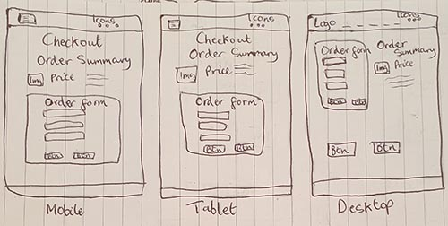
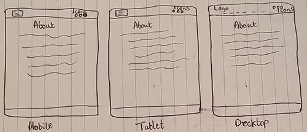
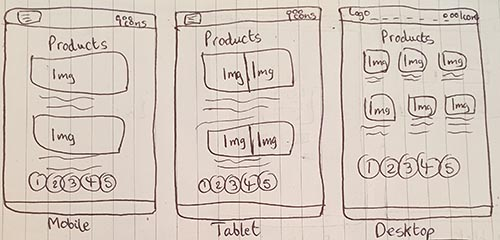

# SUE BENSASSI DESIGNS CI PP5

Sue Bensassi Designs is an eCommerce store dedicated to offering bespoke home accessories crafted with care and precision. As a designer and maker based in West London, Sue Bensassi brings years of experience and passion into creating unique home decor items that can either be purchased as ready-made pieces or custom-made to fit individual preferences.
The primary goal of this project is to create a user-friendly and visually appealing prototype of an online store where customers can easily browse, customise, and purchase home accessories. By leveraging modern web technologies and design principles, we aim to provide a seamless shopping experience that reflects the quality and craftsmanship of Sue Bensassi's products.
The project targets homeowners, interior designers, and gift buyers who value high-quality, custom-made home accessories. Our audience is likely to appreciate unique, personalised items and the flexibility to tailor products to their specific tastes and requirements.

Benefits to the Target Audience:

- Customisation: Customers can order products tailored to their specifications, choosing from a wide range of fabrics and designs, or even providing their own materials for a truly personalised touch.
- Quality and Craftsmanship: Each item is handmade with meticulous attention to detail, ensuring that every purchase is a piece of art.
- Convenience: With detailed delivery information and multiple delivery options, customers can enjoy a smooth and reliable shopping experience.
- Customer Satisfaction: A flexible approach ensures that customers receive products that meet their expectations, with ongoing support for any inquiries or custom orders.

By addressing these objectives and focusing on our target audience, Sue Bensassi Designs aims to enhance the way customers shop for home accessories, offering a personalised, high-quality alternative to mass-produced decor items through this prototype.

You can access the live application [here](https://sue-bensassi-designs-beea48c7d401.herokuapp.com).


## UX

At Sue Bensassi Designs, the website is meticulously crafted to deliver an engaging and intuitive user experience (UX), anchored by a deliberate design approach emphasising both aesthetics and functionality.

The design philosophy revolves around simplicity and elegance, employing a neutral colour palette chosen to convey professionalism and timeless appeal. This choice ensures that the focus remains on the bespoke home accessories showcased throughout the site. Clean lines and uncluttered layouts enhance visual clarity, making navigation and exploration seamless. The final design strikes a balance between contemporary flair and unique elements, all while maintaining a simple and user-friendly interface.

Upon arriving at the website, visitors encounter a clean and inviting interface that sets the tone for a pleasant browsing experience. The design ensures that every element, from the placement of navigation menus to the arrangement of product images and descriptions, enhances usability and encourages exploration.

Navigation is intuitive and user-friendly, facilitated by a persistent menu that grants immediate access to various product categories, informational pages, and shopping essentials. This approach ensures that customers can find what they need quickly and efficiently, whether browsing the curated collection of ready-made items or exploring bespoke customisation options.

Transparency is a cornerstone of the design ethos. The shopping cart and its running total are prominently displayed throughout the browsing journey, empowering customers to manage their selections with confidence. This transparency extends to detailed product pages, where comprehensive information and high-quality images enable customers to make informed decisions.

Customisation lies at the heart of the service, offering a diverse range of fabrics, designs, and customisation options to cater to individual tastes and preferences. Whether choosing from pre-made items or opting for bespoke creations using their own fabric, the design approach ensures that each piece reflects the customer's unique style and vision.

The footer serves as a convenient hub for quick links to essential information, ensuring easy access to detailed product information, delivery policies, and contact options.

In essence, Sue Bensassi Designs combines craftsmanship with user-centric design principles to redefine the online shopping experience for home accessories. The website serves as a platform for showcasing products and as a gateway to an immersive journey where customers can explore, customise, and find inspiration.


### Colour Scheme

The aim was to create a clean, professional, and modern aesthetic for the site, using a combination of bold and subtle colours to ensure clarity and enhance the user experience.

- #000000 (black) is used for text, headings, and buttons, providing a strong contrast and ensuring readability and emphasis.
- #6C757D (gray) is used for the footer and navigation links, giving these areas a more subdued and refined appearance.
- #E6E6E6 (light gray) is used for borders and card bodies, adding a subtle separation between elements without being too stark.
- #FAF7F7 (very light gray) is used for various backgrounds, offering a soft and neutral backdrop that complements the other colours.
- #FFFFFF (white) is used for the navbar, footer text, button text, card header elements, and form backgrounds, maintaining a clean and crisp look throughout the site.

This colour scheme ensures a balance between modern design and usability, making the site visually appealing and easy to navigate.

I used [coolors.co](https://coolors.co/000000-6c757d-e6e6e6-faf7f7-ffffff) to generate my colour palette.


I've used CSS `:root` variables to easily update the global colour scheme by changing only one value, instead of everywhere in the CSS file.

```css
:root {
    --color-primary: rgb(108, 117, 125);
    --color-secondary: rgba(0, 0, 0, 0.3);
    --color-tertiary: rgb(230, 230, 230);
    --color-accent: rgba(182, 211, 229, 0.5);
    --color-text: rgba(0, 0, 0, 1);
    --x: 45deg;
}
```

### Typography

- [Pavanam](https://fonts.google.com/specimen/Pavanam) for headings:

	- Bold and Distinctive: Pavanam's bold and clean lines make it ideal for headings, ensuring that key information stands out and grabs attention.
	- Modern Look: The contemporary style of Pavanam complements the modern aesthetic of the site, reinforcing the professional and polished appearance.

- [Montserrat](https://fonts.google.com/specimen/Montserrat) for the body:

	- Readability: Montserrat is known for its excellent readability, making it perfect for body text where clarity is crucial.
	- Versatile and Elegant: Montserrat's versatile design adapts well to various screen sizes and resolutions, maintaining a sleek and elegant look across different devices.
	- Consistency: Using Montserrat for body text ensures a consistent reading experience, allowing users to easily navigate and consume content without distraction.

Together, these fonts create a harmonious balance between striking headings and readable body text, enhancing the overall visual appeal and functionality of the website.

- [Font Awesome](https://fontawesome.com) icons were used throughout the site, such as the social media icons in the footer.


## User Stories

To guide the development of Sue Bensassi Designs, user stories were created to outline the essential tasks needed to build the website to a high standard. These user stories were further categorised into epics to facilitate an agile development approach.

View a full list of user stories [here](https://github.com/SasanTazayoni/Sue-bensassi-designs-CI-PP5/issues?q=is%3Aissue+label%3A%22User+Story%22).

EPIC 1: User Account Management

- Sign up - As a new site user I can register and establish a personal account on the site so that I can make purchases using my own credentials. `(MUST HAVE)`
- Log in - As a registered user I can log in to my account so that I can review products that I have purchased, view my order history and order products using my credentials. `(MUST HAVE)`
- Log out - As a registered user I can log out of my account so that I can securely end my session and protect my personal information. `(MUST HAVE)`
- Password reset - As a registered user/site admin I can reset my password so that I can regain access to my account in case I forget my password. `(SHOULD HAVE)`
- Edit account details - As a registered user I can edit my account information so that I can ensure that my profile remains up to date and accurate. `(MUST HAVE)`

EPIC 2: Product Exploration

- View all products - As a site user I can see a list of all products so that I can easily browse and explore the full range of available items. `(SHOULD HAVE)`
- Product pricing - As a site user I can see the price of a product clearly so that I can make a decision whether to purchase the item or not. `(MUST HAVE)`
- View product details - As a site user I can view a product on its own individual page so that see more details about the product. `(MUST HAVE)`
- Sort products - As a site user I can sort products by category so that I can find specific products based on the category I select. `(SHOULD HAVE)`
- Popular items - As a site user I can view a list of best-selling items so that I can easily discover popular products that are favoured by other customers, helping me make informed purchasing decisions. `(COULD HAVE)`
- Stock count - As a site user I can view the stock count of products so that I can make informed purchasing decisions based on the availability of items. `(COULD HAVE)`

EPIC 3: Shopping Experience

- Add items to cart - As a registered user I can add items to my cart so that I can conveniently gather desired products in one place while browsing in order to purchase. `(MUST HAVE)`
- Remove items from cart - As a registered user I can remove items from my cart so that I can refine my choices and ensure that my final purchase consists only of the items I truly intend to buy. `(MUST HAVE)`
- View my cart - As a registered user I can view the items in my cart so that I can review my selected products, check quantities and verify prices before proceeding to checkout. `(MUST HAVE)`
- Checkout - As a site user I can checkout with a card payment so that I can complete my purchase transaction securely and efficiently, providing my payment and shipping information to finalise the order and receive the products I have selected. `(MUST HAVE)`
- Order confirmation summary - As a registered user I can receive an email which confirms my order after purchasing from the store so that I can review the details of my purchase and be reassured that my order was successfully processed. `(MUST HAVE)`
- Search for a product - As a site user I can use a search bar to search the website so that I can find a specific product. `(COULD HAVE)`

EPIC 4: Product Management (Admin)

- Stock management - As a site admin I can set the stock count for each product so that I can accurately manage inventory levels, prevent overselling or stockouts and ensure that site users have access to up-to-date information on product availability. `(SHOULD HAVE)`
- Add products - As a site admin I can add products to the store so that I can expand the range of available items and keep the product catalogue updated. `(MUST HAVE)`
- Edit product details - As a site admin I can edit the details of a specific product so that I can keep product information accurate and up to date. `(MUST HAVE)`
- Delete products - As a site admin I can remove products from the store so that I can manage inventory effectively, removing discontinued or outdated items. `(MUST HAVE)`

EPIC 5: Site Information

- Merchant details - As a new site user I can learn about the background of the merchant so that I can gain insight into the company's values and expertise, fostering trust and confidence in their products or services. `(COULD HAVE)`
- Delivery information - As a site user I can access delivery information so that I can understand the shipping options, delivery times and any associated costs, enabling me to plan my purchases accordingly and ensure a smooth and timely delivery of my orders. `(MUST HAVE)`
- Terms and conditions - As a site user I can view the terms and conditions so that I can understand the rules, regulations, and agreements governing the use of the platform, ensuring transparency and clarity in my interactions with the website. `(MUST HAVE)`
- Contact information - As a site user I can easily find and access the store owner's contact information so that I can get in touch for inquiries or assistance. `(MUST HAVE)`

EPIC 6: Marketing and Engagement

- Newsletter - As a site user I can sign up for the site's mailing list so that I can receive special offers and updates in my inbox. `(SHOULD HAVE)`
- Mailing List - As a site admin I can view my mailing list so that I can send special offers or news updates about my products to my subscribers. `(SHOULD HAVE)`
- Facebook marketing - As a site admin I can share the business on Facebook so that I can increase visibility and reach for the platform, attract new users and engage with existing ones on a popular social media platform, ultimately driving traffic to the site and potentially boosting sales and brand recognition. `(MUST HAVE)`
- Appropriate SEO use - As a site admin I can use specific keywords on site pages so that I maximise the probability of new customers locating the store on a Google search. `(MUST HAVE)`

EPIC 7: Additional Features

- Funny Fake Items on 404 Error Page - As a site user I can see humorous fake items on the 404 error page so that I can enjoy a playful experience when encountering page errors. `(COULD HAVE)`

EPIC 8: User Experience and Interface

- First impression - As a new site user I can comprehend the website's purpose at a glance so that I can determine if the platform aligns with my needs and interests. `(MUST HAVE)`
- Website navigation - As a site user I can navigate through the interface effortlessly so that I can quickly and easily find the information I need. `(MUST HAVE)`

EPIC 9: Future Enhancements

- Filter products by price - As a site user I can filter products by price so that I can easily find items that fit within my budget. `(WON'T HAVE)`
- Special offers - As a site user I can receive notifications so that I am promptly informed about any special offers or discounts available on the website. `(WON'T HAVE)`
- View product reviews - As a site user I can view product reviews so that I can make informed purchasing decisions by considering the experiences and opinions of other customers. `(WON'T HAVE)`
- Review a product - As a registered user I can submit a review for a product that I have previously bought so that I can share my experiences and opinions with other users. `(WON'T HAVE)`
- Edit my review - As a registered user I can edit my review on a product so that I can update or improve the information I provided based on further experiences with the product. `(WON'T HAVE)`
- Delete my review - As a registered user I can delete my review on a product so that I can remove outdated or inaccurate feedback. `(WON'T HAVE)`

## Wireframes

<details>
<summary> Click here to see the CART TEMPLATE wireframes </summary>

  - 

</details>
<details>
<summary> Click here to see the CHECKOUT TEMPLATE wireframes </summary>

  - 

</details>
<details>
<summary> Click here to see the CHECKOUT SUCCESS TEMPLATE wireframes </summary>

  - 

</details>
<details>
<summary> Click here to see the CONTACT TEMPLATE wireframes </summary>

  - 

</details>
<details>
<summary> Click here to see the CONTACT SUCCESS TEMPLATE wireframes </summary>

  - 

</details>
<details>
<summary> Click here to see the ABOUT TEMPLATE wireframes </summary>

  - 

</details>
<details>
<summary> Click here to see the DELIVERY TEMPLATE wireframes </summary>

  - 

</details>
<details>
<summary> Click here to see the INDEX TEMPLATE wireframes </summary>

  - 

</details>
<details>
<summary> Click here to see the TERMS & CONDITIONS TEMPLATE wireframes </summary>

  - 

</details>
<details>
<summary> Click here to see the ADD/EDIT PRODUCT TEMPLATE wireframes </summary>

  - 

</details>
<details>
<summary> Click here to see the PRODUCT DETAIL TEMPLATE wireframes </summary>

  - 

</details>
<details>
<summary> Click here to see the PRODUCTS TEMPLATE wireframes </summary>

  - 

</details>
<details>
<summary> Click here to see the PROFILE TEMPLATE wireframes </summary>

  - 

</details>
<details>
<summary> Click here to see the LOGIN TEMPLATE wireframes </summary>

  - 

</details>
<details>
<summary> Click here to see the SIGN UP TEMPLATE wireframes </summary>

  - 

</details>

## Features

### Existing Features

#### Navbar (All pages)

On large screens (992px and above), the navigation bar includes the following elements:


- A logo.
- A search bar for product searches.
- Navigation links for various product categories.
- Three icons arranged from left to right:
	- A home icon for returning to the home page.
	- An account icon for accessing the user account which has a dropdown menu.
	- A cart icon for accessing the shopping cart which shows the total cost of the current cart items.

- 

On smaller screens (991px and below), the navigation bar includes the following elements:

- A toggler with a dropdown menu of the navigation links.
- 
- The same three icons from the large screen with an additional icon for the search. The search icon features a dropdown.
- 

- **YOUR-TITLE-FOR-FEATURE-#1**

    - Details about this particular feature, including the value to the site, and benefit for the user. Be as detailed as possible!


- **YOUR-TITLE-FOR-FEATURE-#2**

    - Details about this particular feature, including the value to the site, and benefit for the user. Be as detailed as possible!


- **YOUR-TITLE-FOR-FEATURE-#3**

    - Details about this particular feature, including the value to the site, and benefit for the user. Be as detailed as possible!


🛑🛑🛑🛑🛑🛑🛑🛑🛑🛑 START OF NOTES (to be deleted)

Repeat as necessary for as many features as your site contains.

Hint: the more, the merrier!

🛑🛑🛑🛑🛑🛑🛑🛑🛑🛑-END OF NOTES (to be deleted)

### Future Features

🛑🛑🛑🛑🛑🛑🛑🛑🛑🛑 START OF NOTES (to be deleted)

Do you have additional ideas that you'd like to include on your project in the future?
Fantastic! List them here!
It's always great to have plans for future improvements!
Consider adding any helpful links or notes to help remind you in the future, if you revisit the project in a couple years.

🛑🛑🛑🛑🛑🛑🛑🛑🛑🛑-END OF NOTES (to be deleted)

- YOUR-TITLE-FOR-FUTURE-FEATURE-#1
    - Any additional notes about this feature.
- YOUR-TITLE-FOR-FUTURE-FEATURE-#2
    - Any additional notes about this feature.
- YOUR-TITLE-FOR-FUTURE-FEATURE-#3
    - Any additional notes about this feature.

## Tools & Technologies Used

🛑🛑🛑🛑🛑🛑🛑🛑🛑🛑 START OF NOTES (to be deleted)

In this section, you should explain the various tools and technologies used to develop the project.
Make sure to put a link (where applicable) to the source, and explain what each was used for.
Some examples have been provided, but this is just a sample only, your project might've used others.
Feel free to delete any unused items below as necessary.

🛑🛑🛑🛑🛑🛑🛑🛑🛑🛑-END OF NOTES (to be deleted)

- ⚠️⚠️ REQUIRED <-- delete me ⚠️⚠️
- [](https://tim.2bn.dev/markdown-builder) used to generate README and TESTING templates.
- [](https://git-scm.com) used for version control. (`git add`, `git commit`, `git push`)
- [](https://github.com) used for secure online code storage.
- ⚠️⚠️ CHOOSE ONLY ONE <-- delete me ⚠️⚠️
- [](https://gitpod.io) used as a cloud-based IDE for development.
- [](https://codeanywhere.com) used as a cloud-based IDE for development.
- [](https://code.visualstudio.com) used as my local IDE for development.
- ⚠️⚠️ CHOOSE ALL APPLICABLE <-- delete me ⚠️⚠️
- [](https://en.wikipedia.org/wiki/HTML) used for the main site content.
- [](https://en.wikipedia.org/wiki/CSS) used for the main site design and layout.
- [](https://www.javascript.com) used for user interaction on the site.
- [](https://jquery.com) used for user interaction on the site.
- [](https://www.python.org) used as the back-end programming language.
- ⚠️⚠️ CHOOSE ONLY ONE <-- delete me ⚠️⚠️
- [](https://pages.github.com) used for hosting the deployed front-end site.
- [](https://www.heroku.com) used for hosting the deployed back-end site.
- ⚠️⚠️ CHOOSE ONLY ONE (if applicable) <-- delete me ⚠️⚠️
- [](https://getbootstrap.com) used as the front-end CSS framework for modern responsiveness and pre-built components.
- [](https://materializecss.com) used as the front-end CSS framework for modern responsiveness and pre-built components.
- ⚠️⚠️ CHOOSE ALL APPLICABLE <-- delete me ⚠️⚠️
- [](https://docs.google.com/spreadsheets) used for storing data from my Python app.
- [](https://jestjs.io) used for automated JavaScript testing.
- [](https://flask.palletsprojects.com) used as the Python framework for the site.
- [](https://www.mongodb.com) used as the non-relational database management with Flask.
- [](https://www.sqlalchemy.org) used as the relational database management with Flask.
- [](https://www.djangoproject.com) used as the Python framework for the site.
- [](https://www.postgresql.org) used as the relational database management.
- [](https://dbs.ci-dbs.net) used as the Postgres database from Code Institute.
- [](https://www.elephantsql.com) used as the Postgres database.
- [](https://cloudinary.com) used for online static file storage.
- [](https://whitenoise.readthedocs.io) used for serving static files with Heroku.
- [](https://stripe.com) used for online secure payments of ecommerce products/services.
- [](https://mail.google.com) used for sending emails in my application.
- [](https://mailchimp.com) used for sending newsletter subscriptions.
- [](https://aws.amazon.com/s3) used for online static file storage.
- [](https://balsamiq.com/wireframes) used for creating wireframes.
- [](https://www.canva.com/p/canvawireframes) used for creating wireframes.
- [](https://developers.google.com/maps) used as an interactive map on my site.
- [](https://leafletjs.com) used as a free open-source interactive map on my site.
- [](https://fontawesome.com) used for the icons.
- [](https://chat.openai.com) used to help debug, troubleshoot, and explain things.

## Database Design

Entity Relationship Diagrams (ERD) help to visualize database architecture before creating models.
Understanding the relationships between different tables can save time later in the project.

🛑🛑🛑🛑🛑🛑🛑🛑🛑🛑 START OF NOTES (to be deleted)

Using your defined models (one example below), create an ERD with the relationships identified.

🛑🛑🛑🛑🛑🛑🛑🛑🛑🛑-END OF NOTES (to be deleted)

```python
class Product(models.Model):
    category = models.ForeignKey(
        "Category", null=True, blank=True, on_delete=models.SET_NULL)
    sku = models.CharField(max_length=254, null=True, blank=True)
    name = models.CharField(max_length=254)
    description = models.TextField()
    has_sizes = models.BooleanField(default=False, null=True, blank=True)
    price = models.DecimalField(max_digits=6, decimal_places=2)
    rating = models.DecimalField(
        max_digits=6, decimal_places=2, null=True, blank=True)
    image_url = models.URLField(max_length=1024, null=True, blank=True)
    image = models.ImageField(null=True, blank=True)

    def __str__(self):
        return self.name
```

🛑🛑🛑🛑🛑🛑🛑🛑🛑🛑 START OF NOTES (to be deleted)

A couple recommendations for building free ERDs:
- [Draw.io](https://draw.io)
- [Lucidchart](https://www.lucidchart.com/pages/ER-diagram-symbols-and-meaning)

A more comprehensive ERD can be auto-generated once you're
at the end of your development stages, just before you submit.
Follow the steps below to obtain a thorough ERD that you can include.
Feel free to leave the steps in the README for future use to yourself.

🛑🛑🛑🛑🛑🛑🛑🛑🛑🛑-END OF NOTES (to be deleted)

I have used `pygraphviz` and `django-extensions` to auto-generate an ERD.

The steps taken were as follows:
- In the terminal: `sudo apt update`
- then: `sudo apt-get install python3-dev graphviz libgraphviz-dev pkg-config`
- then type `Y` to proceed
- then: `pip3 install django-extensions pygraphviz`
- in my `settings.py` file, I added the following to my `INSTALLED_APPS`:
```python
INSTALLED_APPS = [
    ...
    'django_extensions',
    ...
]
```
- back in the terminal: `python3 manage.py graph_models -a -o erd.png`
- dragged the new `erd.png` file into my `documentation/` folder
- removed `'django_extensions',` from my `INSTALLED_APPS`
- finally, in the terminal: `pip3 uninstall django-extensions pygraphviz -y`


source: [medium.com](https://medium.com/@yathomasi1/1-using-django-extensions-to-visualize-the-database-diagram-in-django-application-c5fa7e710e16)


## Agile Development Process

### GitHub Projects

[GitHub Projects](https://github.com/SasanTazayoni/Sue-bensassi-designs-CI-PP5/projects) served as an Agile tool for this project.
It isn't a specialized tool, but with the right tags and project creation/issue assignments, it can be made to work.

Through it, user stories, issues, and milestone tasks were planned, then tracked on a weekly basis using the basic Kanban board.

🛑🛑🛑🛑🛑🛑🛑🛑🛑🛑 START OF NOTES (to be deleted)

Consider adding a basic screenshot of your Projects Board.

🛑🛑🛑🛑🛑🛑🛑🛑🛑🛑-END OF NOTES (to be deleted)


### GitHub Issues

[GitHub Issues](https://github.com/SasanTazayoni/Sue-bensassi-designs-CI-PP5/issues) served as an another Agile tool.
There, I used my own **User Story Template** to manage user stories.

It also helped with milestone iterations on a weekly basis.

🛑🛑🛑🛑🛑🛑🛑🛑🛑🛑 START OF NOTES (to be deleted)

Consider adding a screenshot of your Open and Closed Issues.

🛑🛑🛑🛑🛑🛑🛑🛑🛑🛑-END OF NOTES (to be deleted)

- [Open Issues](https://github.com/SasanTazayoni/Sue-bensassi-designs-CI-PP5/issues) [](https://github.com/SasanTazayoni/Sue-bensassi-designs-CI-PP5/issues)

    

- [Closed Issues](https://github.com/SasanTazayoni/Sue-bensassi-designs-CI-PP5/issues?q=is%3Aissue+is%3Aclosed) [](https://github.com/SasanTazayoni/Sue-bensassi-designs-CI-PP5/issues?q=is%3Aissue+is%3Aclosed)

    

### MoSCoW Prioritization

I've decomposed my Epics into stories prior to prioritizing and implementing them.
Using this approach, I was able to apply the MoSCow prioritization and labels to my user stories within the Issues tab.

- **Must Have**: guaranteed to be delivered (*max 60% of stories*)
- **Should Have**: adds significant value, but not vital (*the rest ~20% of stories*)
- **Could Have**: has small impact if left out (*20% of stories*)
- **Won't Have**: not a priority for this iteration

## Ecommerce Business Model

This site sells goods to individual customers, and therefore follows a `Business to Customer` model.
It is of the simplest **B2C** forms, as it focuses on individual transactions, and doesn't need anything
such as monthly/annual subscriptions.

It is still in its early development stages, although it already has a newsletter, and links for social media marketing.

Social media can potentially build a community of users around the business, and boost site visitor numbers,
especially when using larger platforms such a Facebook.

A newsletter list can be used by the business to send regular messages to site users.
For example, what items are on special offer, new items in stock,
updates to business hours, notifications of events, and much more!

## Search Engine Optimization (SEO) & Social Media Marketing

### Keywords

I've identified some appropriate keywords to align with my site, that should help users
when searching online to find my page easily from a search engine.
This included a series of the following keyword types

- Short-tail (head terms) keywords
- Long-tail keywords

I also played around with [Word Tracker](https://www.wordtracker.com) a bit
to check the frequency of some of my site's primary keywords (only until the free trial expired).

### Sitemap

I've used [XML-Sitemaps](https://www.xml-sitemaps.com) to generate a sitemap.xml file.
This was generated using my deployed site URL: https://sue-bensassi-designs-beea48c7d401.herokuapp.com

After it finished crawling the entire site, it created a
[sitemap.xml](sitemap.xml) which I've downloaded and included in the repository.

### Robots

I've created the [robots.txt](robots.txt) file at the root-level.
Inside, I've included the default settings:

```
User-agent: *
Disallow:
Sitemap: https://sue-bensassi-designs-beea48c7d401.herokuapp.com/sitemap.xml
```

Further links for future implementation:
- [Google search console](https://search.google.com/search-console)
- [Creating and submitting a sitemap](https://developers.google.com/search/docs/advanced/sitemaps/build-sitemap)
- [Managing your sitemaps and using sitemaps reports](https://support.google.com/webmasters/answer/7451001)
- [Testing the robots.txt file](https://support.google.com/webmasters/answer/6062598)

### Social Media Marketing

Creating a strong social base (with participation) and linking that to the business site can help drive sales.
Using more popular providers with a wider user base, such as Facebook, typically maximizes site views.

I've created a mockup Facebook business account using the
[Balsamiq template](https://code-institute-org.github.io/5P-Assessments-Handbook/files/Facebook_Mockups.zip)
provided by Code Institute.


### Newsletter Marketing

I have incorporate a newsletter sign-up form on my application, to allow users to supply their
email address if they are interested in learning more. 

🛑🛑🛑🛑🛑🛑🛑🛑🛑🛑 START OF NOTES (to be deleted)

Option 1 (MailChimp):
- Sign up for a Mailchimp account
- This allows up to 2,500 subscription email sends per month
- Incorporate the code and scripts into your project like in the CI lessons.

Option 2 (Django):
- Create a custom newsletter app in your project, with a custom model.
- This method satisfies two assessment criteria:
    - include a newsletter
    - one of your custom models
- It doesn't need anything except the "email" on the model.
- Example:
    ```python
    class Newsletter(models.Model):
    email = models.EmailField(null=False, blank=False)

    def __str__(self):
        return self.email
    ```
- Consider using the same `send_mail()` functionality used on the `webhook_handler.py` file.
    - You can trigger an email sent out to subscribed users when new products are added to the site!

🛑🛑🛑🛑🛑🛑🛑🛑🛑🛑-END OF NOTES (to be deleted)

## Testing

> [!NOTE]  
> For all testing, please refer to the [TESTING.md](TESTING.md) file.

## Deployment

🛑🛑🛑🛑🛑🛑🛑🛑🛑🛑-START OF NOTES (to be deleted)

**IMPORTANT:**

- ⚠️ DO NOT update the environment variables to your own! These should NOT be included in this file; just demo values! ⚠️
- ⚠️ DO NOT update the environment variables to your own! These should NOT be included in this file; just demo values! ⚠️
- ⚠️ DO NOT update the environment variables to your own! These should NOT be included in this file; just demo values! ⚠️

🛑🛑🛑🛑🛑🛑🛑🛑🛑🛑-END OF NOTES (to be deleted)

The live deployed application can be found deployed on [Heroku](https://sue-bensassi-designs-beea48c7d401.herokuapp.com).

### PostgreSQL Database

This project uses a [Code Institute PostgreSQL Database](https://dbs.ci-dbs.net).

To obtain my own Postgres Database from Code Institute, I followed these steps:

- Signed-in to the CI LMS using my email address.
- An email was sent to me with my new Postgres Database.

> [!CAUTION]  
> - PostgreSQL databases by Code Institute are only available to CI Students.
> - You must acquire your own PostgreSQL database through some other method
> if you plan to clone/fork this repository.
> - Code Institute students are allowed a maximum of 8 databases.
> - Databases are subject to deletion after 18 months.

### Amazon AWS

This project uses [AWS](https://aws.amazon.com) to store media and static files online, due to the fact that Heroku doesn't persist this type of data.

Once you've created an AWS account and logged-in, follow these series of steps to get your project connected.
Make sure you're on the **AWS Management Console** page.

#### S3 Bucket

- Search for **S3**.
- Create a new bucket, give it a name (matching your Heroku app name), and choose the region closest to you.
- Uncheck **Block all public access**, and acknowledge that the bucket will be public (required for it to work on Heroku).
- From **Object Ownership**, make sure to have **ACLs enabled**, and **Bucket owner preferred** selected.
- From the **Properties** tab, turn on static website hosting, and type `index.html` and `error.html` in their respective fields, then click **Save**.
- From the **Permissions** tab, paste in the following CORS configuration:

	```shell
	[
		{
			"AllowedHeaders": [
				"Authorization"
			],
			"AllowedMethods": [
				"GET"
			],
			"AllowedOrigins": [
				"*"
			],
			"ExposeHeaders": []
		}
	]
	```

- Copy your **ARN** string.
- From the **Bucket Policy** tab, select the **Policy Generator** link, and use the following steps:
	- Policy Type: **S3 Bucket Policy**
	- Effect: **Allow**
	- Principal: `*`
	- Actions: **GetObject**
	- Amazon Resource Name (ARN): **paste-your-ARN-here**
	- Click **Add Statement**
	- Click **Generate Policy**
	- Copy the entire Policy, and paste it into the **Bucket Policy Editor**

		```shell
		{
			"Id": "Policy1234567890",
			"Version": "2012-10-17",
			"Statement": [
				{
					"Sid": "Stmt1234567890",
					"Action": [
						"s3:GetObject"
					],
					"Effect": "Allow",
					"Resource": "arn:aws:s3:::your-bucket-name/*"
					"Principal": "*",
				}
			]
		}
		```

	- Before you click "Save", add `/*` to the end of the Resource key in the Bucket Policy Editor (like above).
	- Click **Save**.
- From the **Access Control List (ACL)** section, click "Edit" and enable **List** for **Everyone (public access)**, and accept the warning box.
	- If the edit button is disabled, you need to change the **Object Ownership** section above to **ACLs enabled** (mentioned above).

#### IAM

Back on the AWS Services Menu, search for and open **IAM** (Identity and Access Management).
Once on the IAM page, follow these steps:

- From **User Groups**, click **Create New Group**.
	- Suggested Name: `group-sue-bensassi-designs-ci-pp5` (group + the project name)
- Tags are optional, but you must click it to get to the **review policy** page.
- From **User Groups**, select your newly created group, and go to the **Permissions** tab.
- Open the **Add Permissions** dropdown, and click **Attach Policies**.
- Select the policy, then click **Add Permissions** at the bottom when finished.
- From the **JSON** tab, select the **Import Managed Policy** link.
	- Search for **S3**, select the `AmazonS3FullAccess` policy, and then **Import**.
	- You'll need your ARN from the S3 Bucket copied again, which is pasted into "Resources" key on the Policy.

		```shell
		{
			"Version": "2012-10-17",
			"Statement": [
				{
					"Effect": "Allow",
					"Action": "s3:*",
					"Resource": [
						"arn:aws:s3:::your-bucket-name",
						"arn:aws:s3:::your-bucket-name/*"
					]
				}
			]
		}
		```
	
	- Click **Review Policy**.
	- Suggested Name: `policy-sue-bensassi-designs-ci-pp5` (policy + the project name)
	- Provide a description:
		- "Access to S3 Bucket for sue-bensassi-designs-ci-pp5 static files."
	- Click **Create Policy**.
- From **User Groups**, click your "group-sue-bensassi-designs-ci-pp5".
- Click **Attach Policy**.
- Search for the policy you've just created ("policy-sue-bensassi-designs-ci-pp5") and select it, then **Attach Policy**.
- From **User Groups**, click **Add User**.
	- Suggested Name: `user-sue-bensassi-designs-ci-pp5` (user + the project name)
- For "Select AWS Access Type", select **Programmatic Access**.
- Select the group to add your new user to: `group-sue-bensassi-designs-ci-pp5`
- Tags are optional, but you must click it to get to the **review user** page.
- Click **Create User** once done.
- You should see a button to **Download .csv**, so click it to save a copy on your system.
	- **IMPORTANT**: once you pass this page, you cannot come back to download it again, so do it immediately!
	- This contains the user's **Access key ID** and **Secret access key**.
	- `AWS_ACCESS_KEY_ID` = **Access key ID**
	- `AWS_SECRET_ACCESS_KEY` = **Secret access key**

#### Final AWS Setup

- If Heroku Config Vars has `DISABLE_COLLECTSTATIC` still, this can be removed now, so that AWS will handle the static files.
- Back within **S3**, create a new folder called: `media`.
- Select any existing media images for your project to prepare them for being uploaded into the new folder.
- Under **Manage Public Permissions**, select **Grant public read access to this object(s)**.
- No further settings are required, so click **Upload**.

### Stripe API

This project uses [Stripe](https://stripe.com) to handle the ecommerce payments.

Once you've created a Stripe account and logged-in, follow these series of steps to get your project connected.

- From your Stripe dashboard, click to expand the "Get your test API keys".
- You'll have two keys here:
	- `STRIPE_PUBLIC_KEY` = Publishable Key (starts with **pk**)
	- `STRIPE_SECRET_KEY` = Secret Key (starts with **sk**)

As a backup, in case users prematurely close the purchase-order page during payment, we can include Stripe Webhooks.

- From your Stripe dashboard, click **Developers**, and select **Webhooks**.
- From there, click **Add Endpoint**.
	- `https://sue-bensassi-designs-beea48c7d401.herokuapp.com/checkout/wh/`
- Click **receive all events**.
- Click **Add Endpoint** to complete the process.
- You'll have a new key here:
	- `STRIPE_WH_SECRET` = Signing Secret (Wehbook) Key (starts with **wh**)

### Gmail API

This project uses [Gmail](https://mail.google.com) to handle sending emails to users for account verification and purchase order confirmations.

Once you've created a Gmail (Google) account and logged-in, follow these series of steps to get your project connected.

- Click on the **Account Settings** (cog icon) in the top-right corner of Gmail.
- Click on the **Accounts and Import** tab.
- Within the section called "Change account settings", click on the link for **Other Google Account settings**.
- From this new page, select **Security** on the left.
- Select **2-Step Verification** to turn it on. (verify your password and account)
- Once verified, select **Turn On** for 2FA.
- Navigate back to the **Security** page, and you'll see a new option called **App passwords**.
- This might prompt you once again to confirm your password and account.
- Select **Mail** for the app type.
- Select **Other (Custom name)** for the device type.
	- Any custom name, such as "Django" or Sue-bensassi-designs-CI-PP5
- You'll be provided with a 16-character password (API key).
	- Save this somewhere locally, as you cannot access this key again later!
	- `EMAIL_HOST_PASS` = user's 16-character API key
	- `EMAIL_HOST_USER` = user's own personal Gmail email address

### Heroku Deployment

This project uses [Heroku](https://www.heroku.com), a platform as a service (PaaS) that enables developers to build, run, and operate applications entirely in the cloud.

Deployment steps are as follows, after account setup:

- Select **New** in the top-right corner of your Heroku Dashboard, and select **Create new app** from the dropdown menu.
- Your app name must be unique, and then choose a region closest to you (EU or USA), and finally, select **Create App**.
- From the new app **Settings**, click **Reveal Config Vars**, and set your environment variables.

> [!IMPORTANT]  
> This is a sample only; you would replace the values with your own if cloning/forking my repository.

| Key | Value |
| --- | --- |
| `AWS_ACCESS_KEY_ID` | user's own value |
| `AWS_SECRET_ACCESS_KEY` | user's own value |
| `DATABASE_URL` | user's own value |
| `DISABLE_COLLECTSTATIC` | 1 (*this is temporary, and can be removed for the final deployment*) |
| `EMAIL_HOST_PASS` | user's own value |
| `EMAIL_HOST_USER` | user's own value |
| `SECRET_KEY` | user's own value |
| `STRIPE_PUBLIC_KEY` | user's own value |
| `STRIPE_SECRET_KEY` | user's own value |
| `STRIPE_WH_SECRET` | user's own value |
| `USE_AWS` | True |

Heroku needs three additional files in order to deploy properly.

- requirements.txt
- Procfile
- runtime.txt

You can install this project's **requirements** (where applicable) using:

- `pip3 install -r requirements.txt`

If you have your own packages that have been installed, then the requirements file needs updated using:

- `pip3 freeze --local > requirements.txt`

The **Procfile** can be created with the following command:

- `echo web: gunicorn app_name.wsgi > Procfile`
- *replace **app_name** with the name of your primary Django app name; the folder where settings.py is located*

The **runtime.txt** file needs to know which Python version you're using:
1. type: `python3 --version` in the terminal.
2. in the **runtime.txt** file, add your Python version:
	- `python-3.9.18`

For Heroku deployment, follow these steps to connect your own GitHub repository to the newly created app:

Either:

- Select **Automatic Deployment** from the Heroku app.

Or:

- In the Terminal/CLI, connect to Heroku using this command: `heroku login -i`
- Set the remote for Heroku: `heroku git:remote -a app_name` (replace *app_name* with your app name)
- After performing the standard Git `add`, `commit`, and `push` to GitHub, you can now type:
	- `git push heroku main`

The project should now be connected and deployed to Heroku!

### Local Deployment

This project can be cloned or forked in order to make a local copy on your own system.

For either method, you will need to install any applicable packages found within the *requirements.txt* file.

- `pip3 install -r requirements.txt`.

You will need to create a new file called `env.py` at the root-level,
and include the same environment variables listed above from the Heroku deployment steps.

> [!IMPORTANT]  
> This is a sample only; you would replace the values with your own if cloning/forking my repository.

Sample `env.py` file:

```python
import os

os.environ.setdefault("AWS_ACCESS_KEY_ID", "user's own value")
os.environ.setdefault("AWS_SECRET_ACCESS_KEY", "user's own value")
os.environ.setdefault("DATABASE_URL", "user's own value")
os.environ.setdefault("EMAIL_HOST_PASS", "user's own value")
os.environ.setdefault("EMAIL_HOST_USER", "user's own value")
os.environ.setdefault("SECRET_KEY", "user's own value")
os.environ.setdefault("STRIPE_PUBLIC_KEY", "user's own value")
os.environ.setdefault("STRIPE_SECRET_KEY", "user's own value")
os.environ.setdefault("STRIPE_WH_SECRET", "user's own value")

# local environment only (do not include these in production/deployment!)
os.environ.setdefault("DEBUG", "True")
```

Once the project is cloned or forked, in order to run it locally, you'll need to follow these steps:

- Start the Django app: `python3 manage.py runserver`
- Stop the app once it's loaded: `CTRL+C` or `⌘+C` (Mac)
- Make any necessary migrations: `python3 manage.py makemigrations`
- Migrate the data to the database: `python3 manage.py migrate`
- Create a superuser: `python3 manage.py createsuperuser`
- Load fixtures (if applicable): `python3 manage.py loaddata file-name.json` (repeat for each file)
- Everything should be ready now, so run the Django app again: `python3 manage.py runserver`

If you'd like to backup your database models, use the following command for each model you'd like to create a fixture for:

- `python3 manage.py dumpdata your-model > your-model.json`
- *repeat this action for each model you wish to backup*

#### Cloning

You can clone the repository by following these steps:

1. Go to the [GitHub repository](https://github.com/SasanTazayoni/Sue-bensassi-designs-CI-PP5) 
2. Locate the Code button above the list of files and click it 
3. Select if you prefer to clone using HTTPS, SSH, or GitHub CLI and click the copy button to copy the URL to your clipboard
4. Open Git Bash or Terminal
5. Change the current working directory to the one where you want the cloned directory
6. In your IDE Terminal, type the following command to clone my repository:
	- `git clone https://github.com/SasanTazayoni/Sue-bensassi-designs-CI-PP5.git`
7. Press Enter to create your local clone.

Alternatively, if using Gitpod, you can click below to create your own workspace using this repository.

[](https://gitpod.io/#https://github.com/SasanTazayoni/Sue-bensassi-designs-CI-PP5)

Please note that in order to directly open the project in Gitpod, you need to have the browser extension installed.
A tutorial on how to do that can be found [here](https://www.gitpod.io/docs/configure/user-settings/browser-extension).

#### Forking

By forking the GitHub Repository, we make a copy of the original repository on our GitHub account to view and/or make changes without affecting the original owner's repository.
You can fork this repository by using the following steps:

1. Log in to GitHub and locate the [GitHub Repository](https://github.com/SasanTazayoni/Sue-bensassi-designs-CI-PP5)
2. At the top of the Repository (not top of page) just above the "Settings" Button on the menu, locate the "Fork" Button.
3. Once clicked, you should now have a copy of the original repository in your own GitHub account!

### Local VS Deployment

🛑🛑🛑🛑🛑🛑🛑🛑🛑🛑-START OF NOTES (to be deleted)

Use this space to discuss any differences between the local version you've developed, and the live deployment site on Heroku.

🛑🛑🛑🛑🛑🛑🛑🛑🛑🛑-END OF NOTES (to be deleted)

## Credits

🛑🛑🛑🛑🛑🛑🛑🛑🛑🛑-START OF NOTES (to be deleted)

In this section you need to reference where you got your content, media, and extra help from.
It is common practice to use code from other repositories and tutorials,
however, it is important to be very specific about these sources to avoid plagiarism.

🛑🛑🛑🛑🛑🛑🛑🛑🛑🛑-END OF NOTES (to be deleted)

### Content

🛑🛑🛑🛑🛑🛑🛑🛑🛑🛑-START OF NOTES (to be deleted)

Use this space to provide attribution links to any borrowed code snippets, elements, or resources.
A few examples have been provided below to give you some ideas.

Ideally, you should provide an actual link to every resource used, not just a generic link to the main site!

⚠️⚠️ EXAMPLE LINKS - REPLACE WITH YOUR OWN ⚠️⚠️

🛑🛑🛑🛑🛑🛑🛑🛑🛑🛑-END OF NOTES (to be deleted)

| Source | Location | Notes |
| --- | --- | --- |
| [Markdown Builder](https://tim.2bn.dev/markdown-builder) | README and TESTING | tool to help generate the Markdown files |
| [Chris Beams](https://chris.beams.io/posts/git-commit) | version control | "How to Write a Git Commit Message" |
| [W3Schools](https://www.w3schools.com/howto/howto_js_topnav_responsive.asp) | entire site | responsive HTML/CSS/JS navbar |
| [W3Schools](https://www.w3schools.com/howto/howto_css_modals.asp) | contact page | interactive pop-up (modal) |
| [W3Schools](https://www.w3schools.com/css/css3_variables.asp) | entire site | how to use CSS :root variables |
| [Flexbox Froggy](https://flexboxfroggy.com/) | entire site | modern responsive layouts |
| [Grid Garden](https://cssgridgarden.com) | entire site | modern responsive layouts |
| [StackOverflow](https://stackoverflow.com/a/2450976) | quiz page | Fisher-Yates/Knuth shuffle in JS |
| [YouTube](https://www.youtube.com/watch?v=YL1F4dCUlLc) | leaderboard | using `localStorage()` in JS for high scores |
| [YouTube](https://www.youtube.com/watch?v=u51Zjlnui4Y) | PP3 terminal | tutorial for adding color to the Python terminal |
| [strftime](https://strftime.org) | CRUD functionality | helpful tool to format date/time from string |
| [WhiteNoise](http://whitenoise.evans.io) | entire site | hosting static files on Heroku temporarily |

### Media

🛑🛑🛑🛑🛑🛑🛑🛑🛑🛑-START OF NOTES (to be deleted)

Use this space to provide attribution links to any images, videos, or audio files borrowed from online.
A few examples have been provided below to give you some ideas.

If you're the owner (or a close acquaintance) of all media files, then make sure to specify this.
Let the assessors know that you have explicit rights to use the media files within your project.

Ideally, you should provide an actual link to every media file used, not just a generic link to the main site!
The list below is by no means exhaustive. Within the Code Institute Slack community, you can find more "free media" links
by sending yourself the following command: `!freemedia`.

⚠️⚠️ EXAMPLE LINKS - REPLACE WITH YOUR OWN ⚠️⚠️

🛑🛑🛑🛑🛑🛑🛑🛑🛑🛑-END OF NOTES (to be deleted)

| Source | Location | Type | Notes |
| --- | --- | --- | --- |
| [Pexels](https://www.pexels.com) | entire site | image | favicon on all pages |
| [Lorem Picsum](https://picsum.photos) | home page | image | hero image background |
| [Unsplash](https://unsplash.com) | product page | image | sample of fake products |
| [Pixabay](https://pixabay.com) | gallery page | image | group of photos for gallery |
| [Wallhere](https://wallhere.com) | footer | image | background wallpaper image in the footer |
| [This Person Does Not Exist](https://thispersondoesnotexist.com) | testimonials | image | headshots of fake testimonial images |
| [Audio Micro](https://www.audiomicro.com/free-sound-effects) | game page | audio | free audio files to generate the game sounds |
| [Videvo](https://www.videvo.net/) | home page | video | background video on the hero section |
| [TinyPNG](https://tinypng.com) | entire site | image | tool for image compression |

### Acknowledgements

🛑🛑🛑🛑🛑🛑🛑🛑🛑🛑-START OF NOTES (to be deleted)

Use this space to provide attribution to any supports that helped, encouraged, or supported you throughout the development stages of this project.
A few examples have been provided below to give you some ideas.

⚠️⚠️ EXAMPLES ONLY - REPLACE WITH YOUR OWN ⚠️⚠️

🛑🛑🛑🛑🛑🛑🛑🛑🛑🛑-END OF NOTES (to be deleted)

- I would like to thank my Code Institute mentor, [Tim Nelson](https://github.com/TravelTimN) for his support throughout the development of this project.
- I would like to thank the [Code Institute](https://codeinstitute.net) tutor team for their assistance with troubleshooting and debugging some project issues.
- I would like to thank the [Code Institute Slack community](https://code-institute-room.slack.com) for the moral support; it kept me going during periods of self doubt and imposter syndrome.
- I would like to thank my partner (John/Jane), for believing in me, and allowing me to make this transition into software development.
- I would like to thank my employer, for supporting me in my career development change towards becoming a software developer.
