# SUE BENSASSI DESIGNS CI PP5

Sue Bensassi Designs is an eCommerce store dedicated to offering bespoke home accessories crafted with care and precision. As a designer and maker based in West London, Sue Bensassi brings years of experience and passion into creating unique home decor items that can either be purchased as ready-made pieces or custom-made to fit individual preferences.
The primary goal of this project is to create a user-friendly and visually appealing prototype of an online store where customers can easily browse, customise, and purchase home accessories. By leveraging modern web technologies and design principles, we aim to provide a seamless shopping experience that reflects the quality and craftsmanship of Sue Bensassi's products.
The project targets homeowners, interior designers, and gift buyers who value high-quality, custom-made home accessories. Our audience is likely to appreciate unique, personalised items and the flexibility to tailor products to their specific tastes and requirements.

Benefits to the Target Audience:

- Customisation: Customers can order products tailored to their specifications, choosing from a wide range of fabrics and designs, or even providing their own materials for a truly personalised touch.
- Quality and Craftsmanship: Each item is handmade with meticulous attention to detail, ensuring that every purchase is a piece of art.
- Convenience: With detailed delivery information and multiple delivery options, customers can enjoy a smooth and reliable shopping experience.
- Customer Satisfaction: A flexible approach ensures that customers receive products that meet their expectations, with ongoing support for any inquiries or custom orders.

By addressing these objectives and focusing on our target audience, Sue Bensassi Designs aims to enhance the way customers shop for home accessories, offering a personalised, high-quality alternative to mass-produced decor items through this prototype.

You can access the live application [here](https://sue-bensassi-designs-beea48c7d401.herokuapp.com).


## UX

At Sue Bensassi Designs, the website is meticulously crafted to deliver an engaging and intuitive user experience (UX), anchored by a deliberate design approach emphasising both aesthetics and functionality.

The design philosophy revolves around simplicity and elegance, employing a neutral colour palette chosen to convey professionalism and timeless appeal. This choice ensures that the focus remains on the bespoke home accessories showcased throughout the site. Clean lines and uncluttered layouts enhance visual clarity, making navigation and exploration seamless. The final design strikes a balance between contemporary flair and unique elements, all while maintaining a simple and user-friendly interface.

Upon arriving at the website, visitors encounter a clean and inviting interface that sets the tone for a pleasant browsing experience. The design ensures that every element, from the placement of navigation menus to the arrangement of product images and descriptions, enhances usability and encourages exploration.

Navigation is intuitive and user-friendly, facilitated by a persistent menu that grants immediate access to various product categories, informational pages, and shopping essentials. This approach ensures that customers can find what they need quickly and efficiently, whether browsing the curated collection of ready-made items or exploring bespoke customisation options.

Transparency is a cornerstone of the design ethos. The shopping cart and its running total are prominently displayed throughout the browsing journey, empowering customers to manage their selections with confidence. This transparency extends to detailed product pages, where comprehensive information and high-quality images enable customers to make informed decisions.

Customisation lies at the heart of the service, offering a diverse range of fabrics, designs, and customisation options to cater to individual tastes and preferences. Whether choosing from pre-made items or opting for bespoke creations using their own fabric, the design approach ensures that each piece reflects the customer's unique style and vision.

The footer serves as a convenient hub for quick links to essential information, ensuring easy access to detailed product information, delivery policies, and contact options.

In essence, Sue Bensassi Designs combines craftsmanship with user-centric design principles to redefine the online shopping experience for home accessories. The website serves as a platform for showcasing products and as a gateway to an immersive journey where customers can explore, customise, and find inspiration.


### Colour Scheme

The aim was to create a clean, professional, and modern aesthetic for the site, using a combination of bold and subtle colours to ensure clarity and enhance the user experience.

- #000000 (black) is used for text, headings, and buttons, providing a strong contrast and ensuring readability and emphasis.
- #6C757D (gray) is used for the footer and navigation links, giving these areas a more subdued and refined appearance.
- #E6E6E6 (light gray) is used for borders and card bodies, adding a subtle separation between elements without being too stark.
- #FAF7F7 (very light gray) is used for various backgrounds, offering a soft and neutral backdrop that complements the other colours.
- #FFFFFF (white) is used for the navbar, footer text, button text, card header elements, and form backgrounds, maintaining a clean and crisp look throughout the site.

This colour scheme ensures a balance between modern design and usability, making the site visually appealing and easy to navigate.

I used [coolors.co](https://coolors.co/000000-6c757d-e6e6e6-faf7f7-ffffff) to generate my colour palette.


I've used CSS `:root` variables to easily update the global colour scheme by changing only one value, instead of everywhere in the CSS file.

```css
:root {
    --color-primary: rgb(108, 117, 125);
    --color-secondary: rgba(0, 0, 0, 0.3);
    --color-tertiary: rgb(230, 230, 230);
    --color-accent: rgba(182, 211, 229, 0.5);
    --color-text: rgba(0, 0, 0, 1);
    --x: 45deg;
}
```

### Typography

- [Pavanam](https://fonts.google.com/specimen/Pavanam) for headings:

	- Bold and Distinctive: Pavanam's bold and clean lines make it ideal for headings, ensuring that key information stands out and grabs attention.
	- Modern Look: The contemporary style of Pavanam complements the modern aesthetic of the site, reinforcing the professional and polished appearance.

- [Montserrat](https://fonts.google.com/specimen/Montserrat) for the body:

	- Readability: Montserrat is known for its excellent readability, making it perfect for body text where clarity is crucial.
	- Versatile and Elegant: Montserrat's versatile design adapts well to various screen sizes and resolutions, maintaining a sleek and elegant look across different devices.
	- Consistency: Using Montserrat for body text ensures a consistent reading experience, allowing users to easily navigate and consume content without distraction.

Together, these fonts create a harmonious balance between striking headings and readable body text, enhancing the overall visual appeal and functionality of the website.

- [Font Awesome](https://fontawesome.com) icons were used throughout the site, such as the social media icons in the footer.


## User Stories

To guide the development of Sue Bensassi Designs, user stories were created to outline the essential tasks needed to build the website to a high standard. These user stories were further categorised into epics to facilitate an agile development approach.

View a full list of user stories [here](https://github.com/SasanTazayoni/Sue-bensassi-designs-CI-PP5/issues?q=is%3Aissue+label%3A%22User+Story%22).

EPIC 1: User Account Management

- Sign up - As a new site user I can register and establish a personal account on the site so that I can make purchases using my own credentials. `(MUST HAVE)`
- Log in - As a registered user I can log in to my account so that I can review products that I have purchased, view my order history and order products using my credentials. `(MUST HAVE)`
- Log out - As a registered user I can log out of my account so that I can securely end my session and protect my personal information. `(MUST HAVE)`
- Password reset - As a registered user/site admin I can reset my password so that I can regain access to my account in case I forget my password. `(SHOULD HAVE)`
- Edit account details - As a registered user I can edit my account information so that I can ensure that my profile remains up to date and accurate. `(MUST HAVE)`

EPIC 2: Product Exploration

- View all products - As a site user I can see a list of all products so that I can easily browse and explore the full range of available items. `(SHOULD HAVE)`
- Product pricing - As a site user I can see the price of a product clearly so that I can make a decision whether to purchase the item or not. `(MUST HAVE)`
- View product details - As a site user I can view a product on its own individual page so that see more details about the product. `(MUST HAVE)`
- Sort products - As a site user I can sort products by category so that I can find specific products based on the category I select. `(SHOULD HAVE)`
- Popular items - As a site user I can view a list of best-selling items so that I can easily discover popular products that are favoured by other customers, helping me make informed purchasing decisions. `(COULD HAVE)`
- Stock count - As a site user I can view the stock count of products so that I can make informed purchasing decisions based on the availability of items. `(COULD HAVE)`

EPIC 3: Shopping Experience

- Add items to cart - As a site user I can add items to my cart so that I can conveniently gather desired products in one place while browsing in order to purchase. `(MUST HAVE)`
- Adjust Quantity of Items in Cart - As a site user I can adjust the quantity of items in my cart so that I can easily increase or decrease the number of items I wish to purchase. `(MUST HAVE)`
- Remove items from cart - As a site user I can remove items from my cart so that I can refine my choices and ensure that my final purchase consists only of the items I truly intend to buy. `(MUST HAVE)`
- View my cart - As a site user I can view the items in my cart so that I can review my selected products, check quantities and verify prices before proceeding to checkout. `(MUST HAVE)`
- Checkout - As a site user I can checkout with a card payment so that I can complete my purchase transaction securely and efficiently, providing my payment and shipping information to finalise the order and receive the products I have selected. `(MUST HAVE)`
- Order confirmation summary - As a site user I can receive an email which confirms my order after purchasing from the store so that I can review the details of my purchase and be reassured that my order was successfully processed. `(MUST HAVE)`
- Order history - As a registered user I can access my order history so that I can review past purchases, track the status of my orders and keep a record of my transactions. `(COULD HAVE)`
- Search for a product - As a site user I can use a search bar to search the website so that I can find a specific product. `(COULD HAVE)`

EPIC 4: Product Management (Admin)

- Stock management - As a site admin I can set the stock count for each product so that I can accurately manage inventory levels, prevent overselling or stockouts and ensure that site users have access to up-to-date information on product availability. `(SHOULD HAVE)`
- Add products - As a site admin I can add products to the store so that I can expand the range of available items and keep the product catalogue updated. `(MUST HAVE)`
- Edit product details - As a site admin I can edit the details of a specific product so that I can keep product information accurate and up to date. `(MUST HAVE)`
- Delete products - As a site admin I can remove products from the store so that I can manage inventory effectively, removing discontinued or outdated items. `(MUST HAVE)`

EPIC 5: Site Information

- Merchant details - As a new site user I can learn about the background of the merchant so that I can gain insight into the company's values and expertise, fostering trust and confidence in their products or services. `(COULD HAVE)`
- Delivery information - As a site user I can access delivery information so that I can understand the shipping options, delivery times and any associated costs, enabling me to plan my purchases accordingly and ensure a smooth and timely delivery of my orders. `(MUST HAVE)`
- Terms and conditions - As a site user I can view the terms and conditions so that I can understand the rules, regulations, and agreements governing the use of the platform, ensuring transparency and clarity in my interactions with the website. `(MUST HAVE)`
- Contact information - As a site user I can easily find and access the store owner's contact information so that I can get in touch for inquiries or assistance. `(MUST HAVE)`

EPIC 6: Marketing and Engagement

- Newsletter - As a site user I can sign up for the site's mailing list so that I can receive special offers and updates in my inbox. `(SHOULD HAVE)`
- Mailing List - As a site admin I can view my mailing list so that I can send special offers or news updates about my products to my subscribers. `(SHOULD HAVE)`
- Enquiry list - As a site admin I can a comprehensive list of customer enquiries so that efficiently address each one and manage my responses accordingly.
- Facebook marketing - As a site admin I can share the business on Facebook so that I can increase visibility and reach for the platform, attract new users and engage with existing ones on a popular social media platform, ultimately driving traffic to the site and potentially boosting sales and brand recognition. `(MUST HAVE)`
- Appropriate SEO use - As a site admin I can use specific keywords on site pages so that I maximise the probability of new customers locating the store on a Google search. `(MUST HAVE)`

EPIC 7: Additional Features

- Funny Fake Items on 404 Error Page - As a site user I can see humorous fake items on the 404 error page so that I can enjoy a playful experience when encountering page errors. `(COULD HAVE)`

EPIC 8: User Experience and Interface

- First impression - As a new site user I can comprehend the website's purpose at a glance so that I can determine if the platform aligns with my needs and interests. `(MUST HAVE)`
- Website navigation - As a site user I can navigate through the interface effortlessly so that I can quickly and easily find the information I need. `(MUST HAVE)`

EPIC 9: Future Enhancements

- Filter products by price - As a site user I can filter products by price so that I can easily find items that fit within my budget. `(WON'T HAVE)`
- Special offers - As a site user I can receive notifications so that I am promptly informed about any special offers or discounts available on the website. `(WON'T HAVE)`
- View product reviews - As a site user I can view product reviews so that I can make informed purchasing decisions by considering the experiences and opinions of other customers. `(WON'T HAVE)`
- Review a product - As a registered user I can submit a review for a product that I have previously bought so that I can share my experiences and opinions with other users. `(WON'T HAVE)`
- Edit my review - As a registered user I can edit my review on a product so that I can update or improve the information I provided based on further experiences with the product. `(WON'T HAVE)`
- Delete my review - As a registered user I can delete my review on a product so that I can remove outdated or inaccurate feedback. `(WON'T HAVE)`

## Wireframes

<details>
<summary> Click here to see the CART TEMPLATE wireframes </summary>

  - 

</details>
<details>
<summary> Click here to see the CHECKOUT TEMPLATE wireframes </summary>

  - 

</details>
<details>
<summary> Click here to see the CHECKOUT SUCCESS TEMPLATE wireframes </summary>

  - 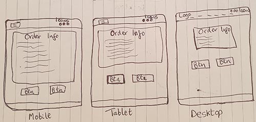

</details>
<details>
<summary> Click here to see the CONTACT TEMPLATE wireframes </summary>

  - 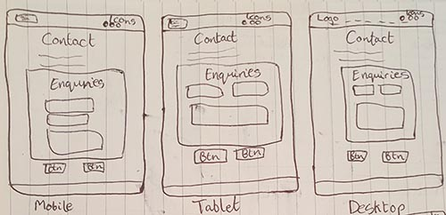

</details>
<details>
<summary> Click here to see the CONTACT SUCCESS TEMPLATE wireframes </summary>

  - 

</details>
<details>
<summary> Click here to see the ABOUT TEMPLATE wireframes </summary>

  - 

</details>
<details>
<summary> Click here to see the DELIVERY TEMPLATE wireframes </summary>

  - 

</details>
<details>
<summary> Click here to see the INDEX TEMPLATE wireframes </summary>

  - 

</details>
<details>
<summary> Click here to see the TERMS & CONDITIONS TEMPLATE wireframes </summary>

  - 

</details>
<details>
<summary> Click here to see the ADD/EDIT PRODUCT TEMPLATE wireframes </summary>

  - 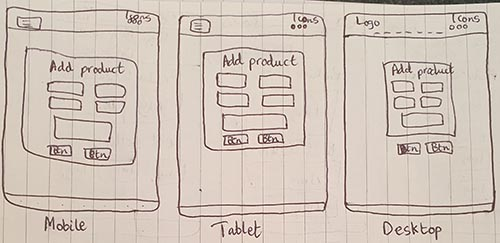

</details>
<details>
<summary> Click here to see the PRODUCT DETAIL TEMPLATE wireframes </summary>

  - 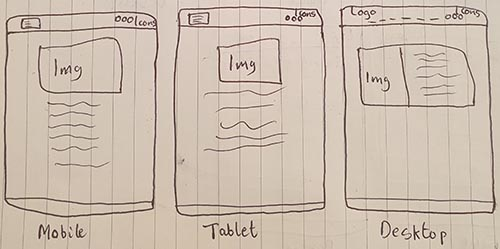

</details>
<details>
<summary> Click here to see the PRODUCTS TEMPLATE wireframes </summary>

  - 

</details>
<details>
<summary> Click here to see the PROFILE TEMPLATE wireframes </summary>

  - 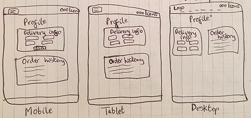

</details>
<details>
<summary> Click here to see the LOGIN TEMPLATE wireframes </summary>

  - 

</details>
<details>
<summary> Click here to see the SIGN UP TEMPLATE wireframes </summary>

  - 

</details>

## Features

### Existing Features

#### Navbar (All pages)

1) On large screens (992px and above), the navigation bar includes the following elements:

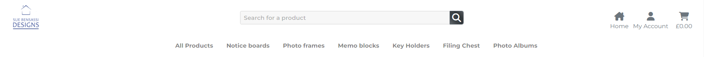

- A logo.
- A search bar for product searches.
- Navigation links for various product categories.
- Three icons arranged from left to right:
	- A home icon for returning to the home page.
	- An account icon for accessing the user account which has a dropdown menu.
	- A cart icon for accessing the shopping cart which shows the total cost of the current cart items.

- 

2) On smaller screens (991px and below), the navigation bar includes the following elements:

- A toggler with a dropdown menu of the navigation links.
- 
- The same three icons from the large screen with an additional icon for the search. The search icon features a dropdown.
- 

3) The "All products" and "Notice boards" navigation links feature dropdown menus.

- The "All products" dropdown menu offers categories to sort products based on various criteria.
- 
- The "Notice boards" dropdown menu provides further subcategories within the notice boards category for more specific sorting options.
- 

#### Footer (All pages)

1) On extra large screens (1300px and above), the footer features 3 separate parts - a credits section with the copyright and credits, footer links to information pages and a newsletter sign up form for users. These elements become stacked vertically at 1299px and below.


- When signing up for the newsletter, the email must be valid otherwise an error will be thrown to the user.
- 
- Duplicate emails cannot be signed up.
- 
- Successful sign ups are saved in the mailing list and the user receives a confirmation email.
- 
- 
- 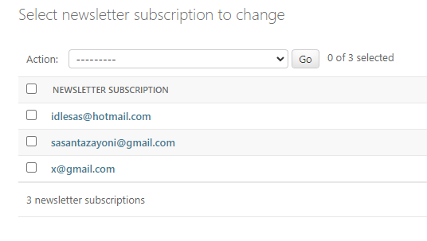

#### Home page

There are 3 main features on the home page which are divided by subtle dividers - the hero section, product showcases and the scroll to top button.

- Hero Section
	- There hero section is divided into 2 sections featuring an eye-catching image and key store information.
	- 
	- The hero also includes navigation buttons to access the store and contact the store owner.
	- On smaller screens, the hero is simplifies to show only the image to reduce clutter.
   	- 
 
- Each section has a subtle section divider


- Product Showcases
	- The first set of products showcases a 3-column grid highlighting 2 filing chests.
   	- 
   	- The second set of products showcases a 3-column grid displaying samples from all item categories.
   	- 
   	- The third set of products showcases a 4-column grid of best sellers within the store.
   	- 
   	- On medium to small screens (768px and below) all grids become single-column grids.
   	- 

- Scroll-to-Top Button
	- Located in the bottom right corner of the page.
   	- Fades in and out based on user scroll position to provide easy navigation back to the top of the page.
   	- 

#### Buttons

Each button features a subtle hover effect achieved through pseudo-selectors. While most buttons maintain a black-grey appearance, certain buttons which have secondary effects such as "Cancel," exhibit a blue-grey colour scheme.

- 

#### Products page

The products page features a paginated grid displaying up to 12 products per page.

- At the top left, there is text indicating the total number of products currently displayed with a link to display all products.
- 
- Pagination buttons are clickable and designed with colours that harmonise with the website's theme.
- 
- Each product is presented as a bordered card containing the product image, name, price, stock count and a button for adding the item to the shopping cart.
- 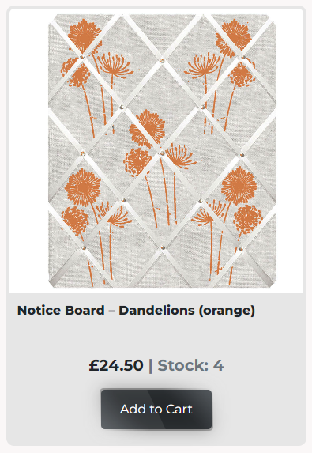
- When an admin user is logged in, additional options to edit and delete the product are available.
- 
- Product grid layouts adapt responsively:
  	- On extra-large screens, products are displayed in a 4-column grid (1200px and above).
  	- 
  	- At screen widths from 992px to 1199px, a 3-column grid layout is used.
  	- 
  	- For widths between 576px and 991px, products appear in a 2-column grid.
  	- 
  	- At 575px and below, products are presented in a single column for optimal viewing on smaller devices.
  	- 

- Products which are out of stock are greyed out distinctly.
- 
- When all notice boards are displayed, buttons appear at the top of the page so that users can easily navigate between the sub-categories of the notice boards.
- 
- This page also features a scroll-to-top button.
- Clicking the product image shows more details of the product on a separate page.

#### Product detail page

The product detail page features a grid with all the product details.

- This includes a large image of the product, product name, product description, product category, the stock count, price per unit, a quantity selector to specify the number of items, a button to add the selected quantity to the cart and a button to return to the shopping page.
- When an admin user is logged in, additional options to edit and delete the product are available.
- 
- On medium screens and larger, the image and details are displayed in a 2-column grid layout. For screens 768px and below, the layout shifts to a single-column grid for better readability on smaller devices.
- 
- 
- The page also has a scroll to top button in case of long descriptions.
- Items which are out of stock are clearly labelled and cannot be added to the cart therefore the quantity selector and "Add to cart" buttons are absent.
- 
- The quantity form will not allow an excess of the product to be added to the cart.
- 

#### Toasts

There are 4 different toasts that exist on this website - red (error), yellow (warning), green (success) and blue (information).

- Red toasts appear when something goes wrong or an action fails (example given above).
- Yellow toasts appear when information is being conveyed.
- 
- Green toasts appear when an action is successful.
- 
- Blue toasts appear when updating the cart. The blue toast also features the current cart details as a quick reference with a "checkout" button.
- 

#### Add/Edit product forms

As an admin user new products can be added and deleted, and existing products can be edited.

- The "Add product" menu item is only available as an admin user.
- 
- The "Add product" and "Edit product" forms are only accessible via an admin user and these enable the creation or edition of product information respectively.
- 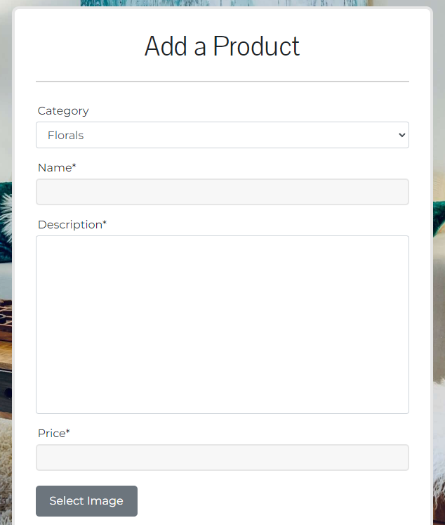
- 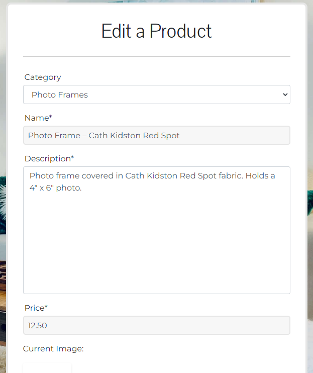
- A newly added product will appear within its category.
- Products with no image get assigned a default image.
- 
- Clicking "Delete" opens a confirmation modal. "No" dismisses the modal and "Yes" permanently removes the product.
- 

#### Shopping cart

The shopping cart page displays a list of all products in the cart, with each product separated by a divider.

- Each row includes the product image, the price per unit, a quantity update form with links to either update the quantity or remove the product entirely and the subtotal for the item based on the quantity ordered.
- At the bottom of the cart, the grand total for all items is displayed, along with buttons to either proceed to checkout or return to the products page.
- The page also has a scroll to top button.

- 
- 

#### Checkout page

The checkout page is designed as a two-column grid. On screens 991px and below, the layout changes to a single-column grid to ensure optimal readability and usability on smaller devices. This page includes the following features:

- Left Column (Form):
	- A form for the customer to fill out their delivery details, including contact number and email.
 	- If the user is logged in, they have the option to save this information to their profile.
	- A button to complete the order or another button to navigate back to the products page.
	- A display of the total amount that the user will be charged.
	- The form must be filled out correctly (including the card details) otherwise the user will receive an error and the payment will not proceed.
- Right Column (Order Summary):
	- An order summary showing the item details and cost breakdown.
- 
- 
- Successfully checking out shows a spinner while the payment processes and locks the page temporarily.
- 

#### Checkout success page

The checkout success page includes the following features:

- A thank you message along with a summary of the recently processed order.
- 
- If the user is logged in, the order information is stored in their order history on their profile.
- The user also receives an email confirmation for their order.
- 
- The store owner also receives an email to notify them of a placed order (This is temporarily set as myself).
- 
- Two buttons at the bottom of the page - One to navigate back to the products page and one to navigate to the user's profile.

#### Profile page

The profile page is a 2-column grid on large screens (992px and above) and a single-column grid on smaller screens (991px and below). It consists of the following 2 features:

- The delivery information of the user.
- An order history form.
- 
- 

#### About page

The about page is a simple page with information with a 2-column grid that becomes a single-column grid on smaller screens.

- 

#### Delivery page

The delivery page is a simple page with the delivery options and information.

- 

#### Terms & conditions page

The terms & conditions page is a simple page with information.

- 

#### Contact and contact success pages

The contact page consists of contact information for the store owner and an enquiry form.

- If the form is correctly filled out then the user will submit the enquiry to the admin panel and get redirected to the contact success page.
- 
- The contact success page will have buttons to navigate back to the home page or the shop.
- 
- Invalid forms will not be submitted.
- The admin panel will show new enquiries and they will be unchecked will signals that they need actioning.
- 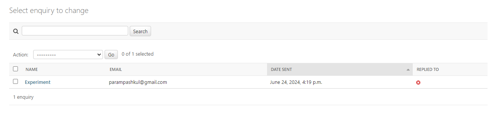

#### Authentication pages

All authentication pages feature a thematic background of a living room, aligning with the store's aesthetic.

- Clicking log out opens a log out modal which logs the user out if "Yes" is clicked.
- 
- The registration form consists of 5 fields which must be correctly filled out.
- 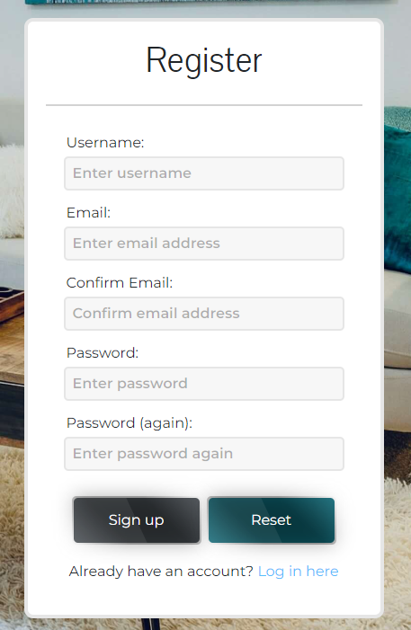
- Invalid fields prevent the sign up procedure and the user gets an error for each invalid field.
- 
- A successful registration will prompt a user to verify their email.
- 
- 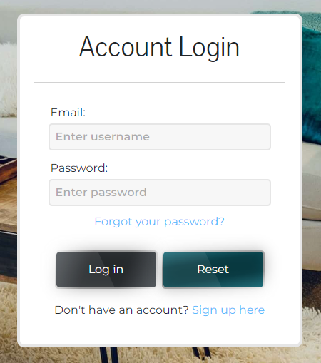
- The registration can be toggled to show the login form instead. The login form also has a link back to the registration form.
- The login form consists of an email and password field.
- 
- Users who want to reset their passwords can do so via the "Forgot your password?" link. This asks the user to enter their email and then sends a token to that email. If the email does not exist, nothing happens. Users can then access their email and use the token to reset their password.
- 
- 
- 
- 
- 

#### Error pages

- In case of an internal server error, the error500 is handled so that the user can return to the home page or shop.
- 
- In case the user navigates to a page that does not exist or enters an incorrect sub-url, the error404 is handled so that a random fake item appears with a message saying that the page does not exist with navigations buttons back to the main site.
- 

### Future Features

Although the site has many features, there are several additional ones I would like to incorporate in the future that didn't fit into the current development cycle. These features have been classified as "Won't Have" in my MoSCoW prioritization and placed in the backlog on my project's development board.

- Filter products by price which would:
  	- Improve Usability: Simplify the shopping process by reducing the time and effort needed to find affordable products.
  	- Potentially Increase Sales: Encourage purchases by making it easier for users to find items they can afford.
  	- Enhance Customer Satisfaction: Provide a more personalised shopping experience, leading to higher customer satisfaction and retention.
 
- Special offers which would:
	- Increase User Engagement: Keeping users informed about promotions, leading to higher engagement and return visits to the site.
 	- Boost Sales: Prompt notifications about discounts and special offers can drive immediate purchases, increasing overall sales.
  	- Enhance User Experience: Providing timely and relevant information helps users make informed purchasing decisions, leading to greater satisfaction and loyalty.
 
- View product reviews which would:
	- Inform Purchasing Decisions: Users can make more informed decisions by reading about others' experiences with the product.
	- Build Trust: Reviews build trust as they provide social proof of product quality and reliability.
	- Enhance User Engagement: Reading reviews encourages users to spend more time on the site, increasing engagement.
- Review a product which would:
	- Customer Feedback: Allows users to share their opinions, which can be valuable for both potential buyers and the store.
	- Product Improvement: Feedback helps the store understand customer preferences and areas for product improvement.
	- Community Building: Encourages interaction among users and creates a community around the products offered.
- Edit my review which would:
	- Update Information: Users can update their review based on their evolving experience with the product.
	- Accuracy: Ensures that the information provided remains relevant and accurate over time.
	- User Control: Provides users with control over their contributions to maintain transparency and trust.
- Delete my review which would:
	- User Control and Privacy: Gives users the option to remove their review if they change their opinion or no longer wish to have it displayed.
 	- Flexibility: Enhances user experience by allowing them to manage their content on the site.
	- Compliance: Aligns with privacy and data protection regulations by offering users the ability to delete personal contributions.

## Tools & Technologies Used

- [](https://tim.2bn.dev/markdown-builder) used to generate README and TESTING templates.
- [](https://git-scm.com) used for version control. (`git add`, `git commit`, `git push`)
- [](https://github.com) used for secure online code storage.
- [](https://gitpod.io) used as a cloud-based IDE for development.
- [](https://en.wikipedia.org/wiki/HTML) used for the main site content.
- [](https://en.wikipedia.org/wiki/CSS) used for the main site design and layout.
- [](https://www.javascript.com) used for user interaction on the site.
- [](https://jquery.com) used for user interaction on the site.
- [](https://www.python.org) used as the back-end programming language.
- [](https://www.heroku.com) used for hosting the deployed back-end site.
- [](https://getbootstrap.com) used as the front-end CSS framework for modern responsiveness and pre-built components.
- [](https://www.djangoproject.com) used as the Python framework for the site.
- [](https://www.postgresql.org) used as the relational database management.
- [](https://dbs.ci-dbs.net) used as the Postgres database from Code Institute.
- [](https://cloudinary.com) used for online static file storage.
- [](https://whitenoise.readthedocs.io) used for serving static files with Heroku.
- [](https://stripe.com) used for online secure payments of ecommerce products/services.
- [](https://mail.google.com) used for sending emails in my application.
- [](https://fontawesome.com) used for the icons.
- [](https://chat.openai.com) used to help debug, troubleshoot, and explain things.

## Database Design

Entity Relationship Diagrams (ERD) help to visualise database architecture before creating models. Understanding the relationships between different tables can save time later in the project. Initially an ERD was established using [draw.io](https://draw.io/) as follows:


This ERD was later updated using `pygraphviz` and `django-extensions` to auto-generate an ERD.

The steps taken were as follows:
- In the terminal: `sudo apt update`
- then: `sudo apt-get install python3-dev graphviz libgraphviz-dev pkg-config`
- then type `Y` to proceed
- then: `pip3 install django-extensions pygraphviz`
- in my `settings.py` file, I added the following to my `INSTALLED_APPS`:
```python
INSTALLED_APPS = [
    ...
    'django_extensions',
    ...
]
```
- back in the terminal: `python3 manage.py graph_models -a -o erd.png`
- dragged the new `erd.png` file into my `documentation/` folder
- removed `'django_extensions',` from my `INSTALLED_APPS`
- finally, in the terminal: `pip3 uninstall django-extensions pygraphviz -y`


## Agile Development Process

### GitHub Projects

[GitHub Projects](https://github.com/SasanTazayoni/Sue-bensassi-designs-CI-PP5/projects) served as an Agile tool for this project.
It isn't a specialised tool, but with the right tags and project creation/issue assignments, it can be made to work.

Through it, user stories, issues, and milestone tasks were planned, then tracked on a weekly basis using the basic Kanban board.


### GitHub Issues

[GitHub Issues](https://github.com/SasanTazayoni/Sue-bensassi-designs-CI-PP5/issues) served as an another Agile tool.
There, I used my own **User Story Template** to manage user stories.

- [Open Issues](https://github.com/SasanTazayoni/Sue-bensassi-designs-CI-PP5/issues)


- [Closed Issues](https://github.com/SasanTazayoni/Sue-bensassi-designs-CI-PP5/issues?q=is%3Aissue+is%3Aclosed)

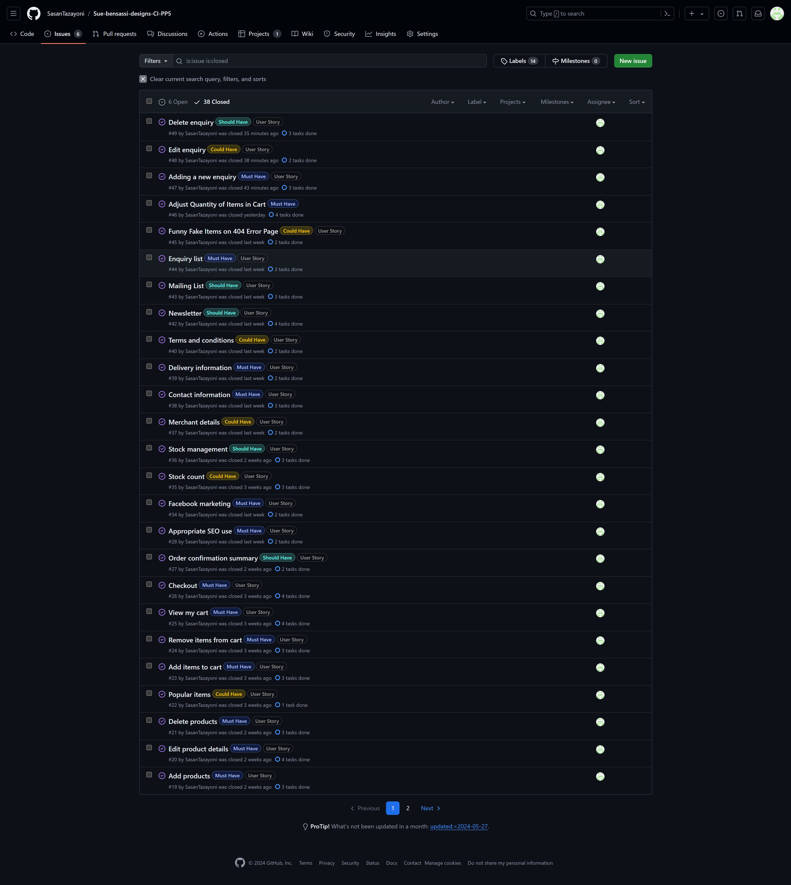
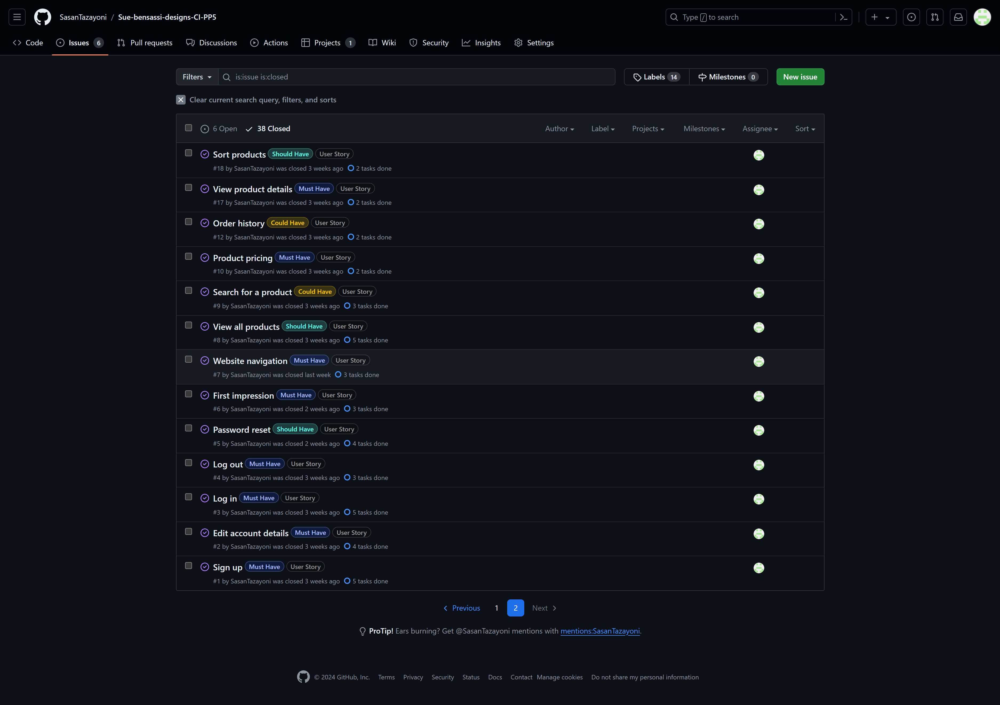

### MoSCoW Prioritization

I've decomposed my Epics into stories prior to prioritizing and implementing them.
Using this approach, I was able to apply the MoSCow prioritisation and labels to my user stories within the Issues tab.

- **Must Have**: guaranteed to be delivered (*max 60% of stories*)
- **Should Have**: adds significant value, but not vital (*the rest ~20% of stories*)
- **Could Have**: has small impact if left out (*20% of stories*)
- **Won't Have**: not a priority for this iteration

## Ecommerce Business Model

This site sells goods to individual customers, and therefore follows a `Business to Customer` model.
It is of the simplest **B2C** forms, as it focuses on individual transactions, and doesn't need anything
such as monthly/annual subscriptions.

It is still in its early development stages, although it already has a newsletter, and links for social media marketing.

Social media can potentially build a community of users around the business, and boost site visitor numbers,
especially when using larger platforms such a Facebook.

A newsletter list can be used by the business to send regular messages to site users.
For example, what items are on special offer, new items in stock,
updates to business hours, notifications of events, and much more!

## Search Engine Optimisation (SEO) & Social Media Marketing

### Keywords

I've identified some appropriate keywords to align with my site, that should help users
when searching online to find my page easily from a search engine.
This included a series of the following keyword types

- Short-tail (head terms) keywords
- Long-tail keywords

I also played around with [Word Tracker](https://www.wordtracker.com) a bit
to check the frequency of some of my site's primary keywords (only until the free trial expired).

### Sitemap

I've used [XML-Sitemaps](https://www.xml-sitemaps.com) to generate a sitemap.xml file.
This was generated using my deployed site URL: https://sue-bensassi-designs-beea48c7d401.herokuapp.com/

After it finished crawling the entire site, it created a
[sitemap.xml](sitemap.xml) which I've downloaded and included in the repository.

### Robots

I've created the [robots.txt](robots.txt) file at the root-level.
Inside, I've included the default settings:

```
User-agent: *
Disallow:
Sitemap: https://sue-bensassi-designs-beea48c7d401.herokuapp.com/sitemap.xml
```

Further links for future implementation:
- [Google search console](https://search.google.com/search-console)
- [Creating and submitting a sitemap](https://developers.google.com/search/docs/advanced/sitemaps/build-sitemap)
- [Managing your sitemaps and using sitemaps reports](https://support.google.com/webmasters/answer/7451001)
- [Testing the robots.txt file](https://support.google.com/webmasters/answer/6062598)

### Social Media Marketing

Creating a strong social base (with participation) and linking that to the business site can help drive sales.
Using more popular providers with a wider user base, such as Facebook, typically maximises site views.


### Newsletter Marketing

I have incorporated a newsletter sign-up form on my application, to allow users to supply their
email address if they are interested in learning more.

A custom newsletter app was developed for this project, incorporating a NewsletterSubscription model. I also included a form in the site's footer to gather user email addresses.

```python
class NewsletterSubscription(models.Model):
    email = models.EmailField(
        unique=True, null=False, blank=False
    )

    def __str__(self):
        return self.email
```

Only valid and non-duplicated emails can sign up. The user will receive an email if they successfully subscribe. There are screenshots of these in the "Features" section above.

## Testing

> [!NOTE]  
> For all testing, please refer to the [TESTING.md](TESTING.md) file.

## Deployment

The live deployed application can be found deployed on [Heroku](https://sue-bensassi-designs-beea48c7d401.herokuapp.com).

### PostgreSQL Database

This project uses a [Code Institute PostgreSQL Database](https://dbs.ci-dbs.net).

To obtain my own Postgres Database from Code Institute, I followed these steps:

- Signed-in to the CI LMS using my email address.
- An email was sent to me with my new Postgres Database.

> [!CAUTION]  
> - PostgreSQL databases by Code Institute are only available to CI Students.
> - You must acquire your own PostgreSQL database through some other method
> if you plan to clone/fork this repository.
> - Code Institute students are allowed a maximum of 8 databases.
> - Databases are subject to deletion after 18 months.

### Cloudinary API

This project uses the [Cloudinary API](https://cloudinary.com) to store media assets online, due to the fact that Heroku doesn't persist this type of data.

To obtain your own Cloudinary API key, create an account and log in.

- For *Primary interest*, you can choose *Programmable Media for image and video API*.
- Optional: *edit your assigned cloud name to something more memorable*.
- On your Cloudinary Dashboard, you can copy your **API Environment Variable**.
- Be sure to remove the `CLOUDINARY_URL=` as part of the API **value**; this is the **key**.

### Stripe API

This project uses [Stripe](https://stripe.com) to handle the ecommerce payments.

Once you've created a Stripe account and logged-in, follow these series of steps to get your project connected.

- From your Stripe dashboard, click to expand the "Get your test API keys".
- You'll have two keys here:
	- `STRIPE_PUBLIC_KEY` = Publishable Key (starts with **pk**)
	- `STRIPE_SECRET_KEY` = Secret Key (starts with **sk**)

As a backup, in case users prematurely close the purchase-order page during payment, we can include Stripe Webhooks.

- From your Stripe dashboard, click **Developers**, and select **Webhooks**.
- From there, click **Add Endpoint**.
	- `https://sue-bensassi-designs-beea48c7d401.herokuapp.com/checkout/wh/`
- Click **receive all events**.
- Click **Add Endpoint** to complete the process.
- You'll have a new key here:
	- `STRIPE_WH_SECRET` = Signing Secret (Wehbook) Key (starts with **wh**)

### Gmail API

This project uses [Gmail](https://mail.google.com) to handle sending emails to users for account verification and purchase order confirmations.

Once you've created a Gmail (Google) account and logged-in, follow these series of steps to get your project connected.

- Click on the **Account Settings** (cog icon) in the top-right corner of Gmail.
- Click on the **Accounts and Import** tab.
- Within the section called "Change account settings", click on the link for **Other Google Account settings**.
- From this new page, select **Security** on the left.
- Select **2-Step Verification** to turn it on. (verify your password and account)
- Once verified, select **Turn On** for 2FA.
- Navigate back to the **Security** page, and you'll see a new option called **App passwords**.
- This might prompt you once again to confirm your password and account.
- Select **Mail** for the app type.
- Select **Other (Custom name)** for the device type.
	- Any custom name, such as "Django" or Sue-bensassi-designs-CI-PP5
- You'll be provided with a 16-character password (API key).
	- Save this somewhere locally, as you cannot access this key again later!
	- `EMAIL_HOST_PASS` = user's 16-character API key
	- `EMAIL_HOST_USER` = user's own personal Gmail email address

### Heroku Deployment

This project uses [Heroku](https://www.heroku.com), a platform as a service (PaaS) that enables developers to build, run, and operate applications entirely in the cloud.

Deployment steps are as follows, after account setup:

- Select **New** in the top-right corner of your Heroku Dashboard, and select **Create new app** from the dropdown menu.
- Your app name must be unique, and then choose a region closest to you (EU or USA), and finally, select **Create App**.
- From the new app **Settings**, click **Reveal Config Vars**, and set your environment variables.

> [!IMPORTANT]  
> This is a sample only; you would replace the values with your own if cloning/forking my repository.

| Key | Value |
| --- | --- |
| `CLOUDINARY_URL` | user's own value |
| `HOST` | user's own value |
| `DATABASE_URL` | user's own value |
| `DISABLE_COLLECTSTATIC` | 1 (*this is temporary, and can be removed for the final deployment*) |
| `EMAIL_HOST_PASS` | user's own value |
| `EMAIL_HOST_USER` | user's own value |
| `SECRET_KEY` | user's own value |
| `STRIPE_PUBLIC_KEY` | user's own value |
| `STRIPE_SECRET_KEY` | user's own value |
| `STRIPE_WH_SECRET` | user's own value |
| `TEMP_EMAIL` | user's own value |

Heroku needs three additional files in order to deploy properly.

- requirements.txt
- Procfile
- runtime.txt

You can install this project's **requirements** (where applicable) using:

- `pip3 install -r requirements.txt`

If you have your own packages that have been installed, then the requirements file needs updated using:

- `pip3 freeze --local > requirements.txt`

The **Procfile** can be created with the following command:

- `echo web: gunicorn app_name.wsgi > Procfile`
- *replace **app_name** with the name of your primary Django app name; the folder where settings.py is located*

The **runtime.txt** file needs to know which Python version you're using:
1. type: `python3 --version` in the terminal.
2. in the **runtime.txt** file, add your Python version:
	- `python-3.9.18`

For Heroku deployment, follow these steps to connect your own GitHub repository to the newly created app:

Either:

- Select **Automatic Deployment** from the Heroku app.

Or:

- In the Terminal/CLI, connect to Heroku using this command: `heroku login -i`
- Set the remote for Heroku: `heroku git:remote -a app_name` (replace *app_name* with your app name)
- After performing the standard Git `add`, `commit`, and `push` to GitHub, you can now type:
	- `git push heroku main`

The project should now be connected and deployed to Heroku!

### Local Deployment

This project can be cloned or forked in order to make a local copy on your own system.

For either method, you will need to install any applicable packages found within the *requirements.txt* file.

- `pip3 install -r requirements.txt`.

You will need to create a new file called `env.py` at the root-level,
and include the same environment variables listed above from the Heroku deployment steps.

> [!IMPORTANT]  
> This is a sample only; you would replace the values with your own if cloning/forking my repository.

Sample `env.py` file:

```python
import os

os.environ.setdefault("AWS_ACCESS_KEY_ID", "user's own value")
os.environ.setdefault("AWS_SECRET_ACCESS_KEY", "user's own value")
os.environ.setdefault("DATABASE_URL", "user's own value")
os.environ.setdefault("EMAIL_HOST_PASS", "user's own value")
os.environ.setdefault("EMAIL_HOST_USER", "user's own value")
os.environ.setdefault("SECRET_KEY", "user's own value")
os.environ.setdefault("STRIPE_PUBLIC_KEY", "user's own value")
os.environ.setdefault("STRIPE_SECRET_KEY", "user's own value")
os.environ.setdefault("STRIPE_WH_SECRET", "user's own value")
os.environ.setdefault("TEMP_EMAIL", "user's own value")

# local environment only (do not include these in production/deployment!)
os.environ.setdefault("DEBUG", "True")
```

Once the project is cloned or forked, in order to run it locally, you'll need to follow these steps:

- Start the Django app: `python3 manage.py runserver`
- Stop the app once it's loaded: `CTRL+C` or `+C` (Mac)
- Make any necessary migrations: `python3 manage.py makemigrations`
- Migrate the data to the database: `python3 manage.py migrate`
- Create a superuser: `python3 manage.py createsuperuser`
- Load fixtures (if applicable): `python3 manage.py loaddata file-name.json` (repeat for each file)
- Everything should be ready now, so run the Django app again: `python3 manage.py runserver`

If you'd like to backup your database models, use the following command for each model you'd like to create a fixture for:

- `python3 manage.py dumpdata your-model > your-model.json`
- *repeat this action for each model you wish to backup*

#### Cloning

You can clone the repository by following these steps:

1. Go to the [GitHub repository](https://github.com/SasanTazayoni/Sue-bensassi-designs-CI-PP5) 
2. Locate the Code button above the list of files and click it 
3. Select if you prefer to clone using HTTPS, SSH, or GitHub CLI and click the copy button to copy the URL to your clipboard
4. Open Git Bash or Terminal
5. Change the current working directory to the one where you want the cloned directory
6. In your IDE Terminal, type the following command to clone my repository:
	- `git clone https://github.com/SasanTazayoni/Sue-bensassi-designs-CI-PP5.git`
7. Press Enter to create your local clone.

Alternatively, if using Gitpod, you can click below to create your own workspace using this repository.

[](https://gitpod.io/#https://github.com/SasanTazayoni/Sue-bensassi-designs-CI-PP5)

Please note that in order to directly open the project in Gitpod, you need to have the browser extension installed.
A tutorial on how to do that can be found [here](https://www.gitpod.io/docs/configure/user-settings/browser-extension).

#### Forking

By forking the GitHub Repository, we make a copy of the original repository on our GitHub account to view and/or make changes without affecting the original owner's repository.
You can fork this repository by using the following steps:

1. Log in to GitHub and locate the [GitHub Repository](https://github.com/SasanTazayoni/Sue-bensassi-designs-CI-PP5)
2. At the top of the Repository (not top of page) just above the "Settings" Button on the menu, locate the "Fork" Button.
3. Once clicked, you should now have a copy of the original repository in your own GitHub account!

### Local VS Deployment

In the local environment:
* All variables are retrieved from the env.py file.
* DEBUG is set to "True".
* DEVELOPMENT is set to "True" therefore emails are generated in the terminal.

On Heroku:
* All variables are retrieved from the Config Vars in the settings.
* DEBUG is set to "False".
* The DEVELOPMENT variable is absent therefore defaults to "False" which allows emails to be sent directly using the Gmail API.

## Credits

### Content

| Source | Location | Notes |
| --- | --- | --- |
| [Markdown Builder](https://tim.2bn.dev/markdown-builder) | README and TESTING | tool to help generate the Markdown files |
| [Online Tutorials](https://www.youtube.com/watch?v=YKv3F9gcGuc&t) | Buttons | Hover special effect |
| [WhiteNoise](http://whitenoise.evans.io) | entire site | hosting static files on Heroku temporarily |

### Media

| Source | Location | Type | Notes |
| --- | --- | --- | --- |
| [Unsplash](https://unsplash.com) | authentication pages | image | background image |
| [TinyPNG](https://tinypng.com) | entire site | image | tool for image compression |
| [Google Fonts](https://fonts.google.com/) | entire site | font | headers and text |
| [Photoshop](https://www.adobe.com/uk/products/photoshop/) | products page | image | tool for image adjustment |
| [Favicon.io](https://favicon.io/) | browser tab | image | favicon generator |
| Sue Bensassi | entire site | image | images obtained from client |

### Acknowledgements

- I would like to thank my Code Institute mentor, [Tim Nelson](https://github.com/TravelTimN) for his support throughout the development of this project.
- I would like to thank the [Code Institute](https://codeinstitute.net) tutor team, particularly Sean Murphy and Oisin Tohak, for their assistance with troubleshooting and debugging some project issues.
