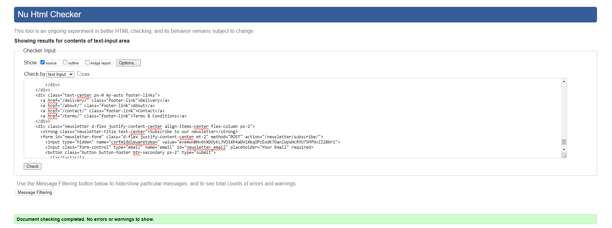
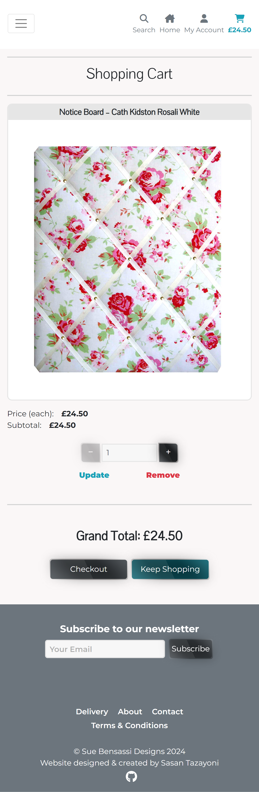
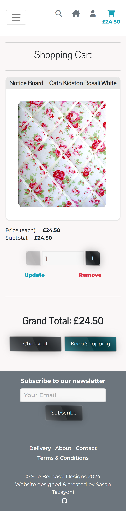
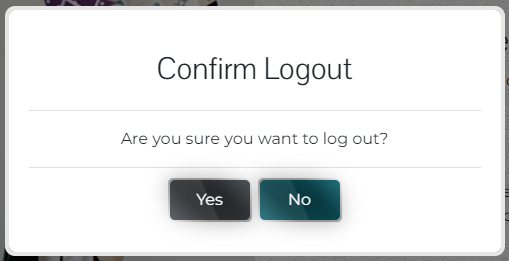
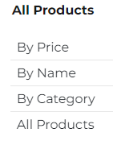
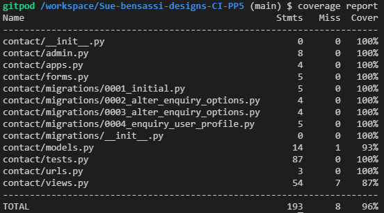

# Testing

> [!NOTE]  
> Return back to the [README.md](README.md) file.

## Code Validation

### HTML

I have used the recommended [HTML W3C Validator](https://validator.w3.org) to validate all of my HTML files.

As my project uses Jinja syntax, such as ``, ``, and `{{ variable|filter }}` it will not validate properly if I copy and paste into the HTML validator straight from my source files. In order to properly validate these types of files, it's recommended to [validate by uri](https://validator.w3.org/#validate_by_uri) from the deployed Heroku pages.

Some of the pages on this site require a user to be logged-in and authenticated and will not work using this method, due to the fact that the HTML Validator (W3C) doesn't have access to login to the pages. In these cases the following steps have to be taken:

* Navigate to the deployed pages which require authentication.
* Right-click on the page and select View Page Source (usually `CTRL+U` or `⌘+U` on Mac).
* This will display the entire "compiled" code, without any Jinja syntax.
* Copy everything, and use the [validate by input](https://validator.w3.org/#validate_by_input) method.
* Repeat this process for every page that requires a user to be logged-in/authenticated.

| Page | W3C URL | Screenshot | Notes |
| --- | --- | --- | --- |
| Cart | [W3C](https://validator.w3.org/nu/?doc=https%3A%2F%2Fsue-bensassi-designs-beea48c7d401.herokuapp.com%2Fcart%2F) |  | Pass: No errors |
| Checkout | [W3C](https://validator.w3.org/nu/?doc=https%3A%2F%2Fsue-bensassi-designs-beea48c7d401.herokuapp.com%2Fcheckout%2F) |  | Pass: No errors |
| Checkout success | n/a |  | Pass: No errors |
| Contact | [W3C](https://validator.w3.org/nu/?doc=https%3A%2F%2Fsue-bensassi-designs-beea48c7d401.herokuapp.com%2Fcontact%2F) |  | Pass: No errors |
| Contact success | [W3C](https://validator.w3.org/nu/?doc=https%3A%2F%2Fsue-bensassi-designs-beea48c7d401.herokuapp.com%2Fcontact%2Fsuccess%2F) |  | Pass: No errors |
| Edit enquiry | n/a |  | Pass: No errors |
| About | [W3C](https://validator.w3.org/nu/?doc=https%3A%2F%2Fsue-bensassi-designs-beea48c7d401.herokuapp.com%2Fabout%2F) |  | Pass: No errors |
| Delivery | [W3C](https://validator.w3.org/nu/?doc=https%3A%2F%2Fsue-bensassi-designs-beea48c7d401.herokuapp.com%2Fdelivery%2F) |  | Pass: No errors |
| Index | [W3C](https://validator.w3.org/nu/?doc=https%3A%2F%2Fsue-bensassi-designs-beea48c7d401.herokuapp.com%2F) |  | Pass: No errors |
| Terms & conditions | [W3C](https://validator.w3.org/nu/?doc=https%3A%2F%2Fsue-bensassi-designs-beea48c7d401.herokuapp.com%2Fterms%2F) |  | Pass: No errors |
| Products | [W3C](https://validator.w3.org/nu/?doc=https%3A%2F%2Fsue-bensassi-designs-beea48c7d401.herokuapp.com%2Fcontact%2Fsuccess%2F) |  | Pass: No errors |
| Product detail | [W3C](https://validator.w3.org/nu/?doc=https%3A%2F%2Fsue-bensassi-designs-beea48c7d401.herokuapp.com%2Fproducts%2F96%2F) |  | Pass: No errors |
| Add product | n/a |  | Pass: No errors |
| Edit product | n/a |  | Pass: No errors |
| Profile | n/a |  | Pass: No errors |
| Sign up | [W3C](https://validator.w3.org/nu/?doc=https%3A%2F%2Fsue-bensassi-designs-beea48c7d401.herokuapp.com%2Faccounts%2Fsignup%2F) |  | Pass: No errors |
| Log in | [W3C](https://validator.w3.org/nu/?doc=https%3A%2F%2Fsue-bensassi-designs-beea48c7d401.herokuapp.com%2Faccounts%2Flogin%2F) |  | Pass: No errors |
| Search | [W3C](https://validator.w3.org/nu/?doc=https%3A%2F%2F8000-sasantazayo-suebensassi-813vyfvgjj0.ws.codeinstitute-ide.net%2Fproducts%2F%3Fq%3Dbook) |  | Pass: No errors |

### CSS

I have used the recommended [CSS Jigsaw Validator](https://jigsaw.w3.org/css-validator) to validate all of my CSS files.

| File | Jigsaw URL | Screenshot | Notes |
| --- | --- | --- | --- |
| styles.css | [Jigsaw](https://jigsaw.w3.org/css-validator/validator?uri=https%3A%2F%2Fsue-bensassi-designs-beea48c7d401.herokuapp.com%2Fstatic%2Fcss%2Fstyles.css&profile=css3svg&usermedium=all&warning=1&vextwarning=&lang=en) |  | Pass: No Errors |

### JavaScript

I have used the recommended [JShint Validator](https://jshint.com) to validate all of my JS files.

| File | Screenshot | Notes |
| --- | --- | --- |
| buttons.js |  | Pass: No Errors |
| disableSubmit.js |  | Pass: No Errors |
| dynamicMargin.js |  | Pass: No Errors |
| logoutModal.js |  | Pass: No Errors |
| navbar.js |  | Pass: No Errors |
| newsletter.js |  | Pass: No Errors |
| quantityInput.js |  | Pass: No Errors |
| scrollToTop.js |  | Pass: No Errors |
| shoppingCartQuantities.js |  | Pass: No Errors |
| stripeElements.js |  | Undefined Stripe variable |
| toasts.js |  | Pass: No Errors |

### Python

I have used the recommended [PEP8 CI Python Linter](https://pep8ci.herokuapp.com) to validate all of my Python files.

| Directory | File | CI URL | Screenshot | Notes |
| --- | --- | --- | --- | --- |
| cart | contexts.py | [PEP8 CI](https://pep8ci.herokuapp.com/https://raw.githubusercontent.com/SasanTazayoni/Sue-bensassi-designs-CI-PP5/main/cart/contexts.py) |  | Pass: No Errors |
| cart | urls.py | [PEP8 CI](https://pep8ci.herokuapp.com/https://raw.githubusercontent.com/SasanTazayoni/Sue-bensassi-designs-CI-PP5/main/cart/urls.py) |  | Pass: No Errors |
| cart | views.py | [PEP8 CI](https://pep8ci.herokuapp.com/https://raw.githubusercontent.com/SasanTazayoni/Sue-bensassi-designs-CI-PP5/main/cart/views.py) |  | Pass: No Errors |
| checkout | admin.py | [PEP8 CI](https://pep8ci.herokuapp.com/https://raw.githubusercontent.com/SasanTazayoni/Sue-bensassi-designs-CI-PP5/main/checkout/admin.py) |  | Pass: No Errors |
| checkout | forms.py | [PEP8 CI](https://pep8ci.herokuapp.com/https://raw.githubusercontent.com/SasanTazayoni/Sue-bensassi-designs-CI-PP5/main/checkout/forms.py) |  | Pass: No Errors |
| checkout | models.py | [PEP8 CI](https://pep8ci.herokuapp.com/https://raw.githubusercontent.com/SasanTazayoni/Sue-bensassi-designs-CI-PP5/main/checkout/models.py) |  | Pass: No Errors |
| checkout | signals.py | [PEP8 CI](https://pep8ci.herokuapp.com/https://raw.githubusercontent.com/SasanTazayoni/Sue-bensassi-designs-CI-PP5/main/checkout/signals.py) |  | Pass: No Errors |
| checkout | urls.py | [PEP8 CI](https://pep8ci.herokuapp.com/https://raw.githubusercontent.com/SasanTazayoni/Sue-bensassi-designs-CI-PP5/main/checkout/urls.py) |  | Pass: No Errors |
| checkout | views.py | [PEP8 CI](https://pep8ci.herokuapp.com/https://raw.githubusercontent.com/SasanTazayoni/Sue-bensassi-designs-CI-PP5/main/checkout/views.py) |  | Pass: No Errors |
| checkout | webhook_handler.py | [PEP8 CI](https://pep8ci.herokuapp.com/https://raw.githubusercontent.com/SasanTazayoni/Sue-bensassi-designs-CI-PP5/main/checkout/webhook_handler.py) |  | Pass: No Errors |
| checkout | webhooks.py | [PEP8 CI](https://pep8ci.herokuapp.com/https://raw.githubusercontent.com/SasanTazayoni/Sue-bensassi-designs-CI-PP5/main/checkout/webhooks.py) |  | Pass: No Errors |
| contact | admin.py | [PEP8 CI](https://pep8ci.herokuapp.com/https://raw.githubusercontent.com/SasanTazayoni/Sue-bensassi-designs-CI-PP5/main/contact/admin.py) |  | Pass: No Errors |
| contact | forms.py | [PEP8 CI](https://pep8ci.herokuapp.com/https://raw.githubusercontent.com/SasanTazayoni/Sue-bensassi-designs-CI-PP5/main/contact/forms.py) |  | Pass: No Errors |
| contact | models.py | [PEP8 CI](https://pep8ci.herokuapp.com/https://raw.githubusercontent.com/SasanTazayoni/Sue-bensassi-designs-CI-PP5/main/contact/models.py) |  | Pass: No Errors |
| contact | urls.py | [PEP8 CI](https://pep8ci.herokuapp.com/https://raw.githubusercontent.com/SasanTazayoni/Sue-bensassi-designs-CI-PP5/main/contact/urls.py) |  | Pass: No Errors |
| contact | views.py | [PEP8 CI](https://pep8ci.herokuapp.com/https://raw.githubusercontent.com/SasanTazayoni/Sue-bensassi-designs-CI-PP5/main/contact/views.py) |  | Pass: No Errors |
| core | urls.py | [PEP8 CI](https://pep8ci.herokuapp.com/https://raw.githubusercontent.com/SasanTazayoni/Sue-bensassi-designs-CI-PP5/main/core/urls.py) |  | Pass: No Errors |
| core | views.py | [PEP8 CI](https://pep8ci.herokuapp.com/https://raw.githubusercontent.com/SasanTazayoni/Sue-bensassi-designs-CI-PP5/main/core/views.py) |  | Pass: No Errors |
| newsletter | admin.py | [PEP8 CI](https://pep8ci.herokuapp.com/https://raw.githubusercontent.com/SasanTazayoni/Sue-bensassi-designs-CI-PP5/main/newsletter/admin.py) |  | Pass: No Errors |
| newsletter | forms.py | [PEP8 CI](https://pep8ci.herokuapp.com/https://raw.githubusercontent.com/SasanTazayoni/Sue-bensassi-designs-CI-PP5/main/newsletter/forms.py) |  | Pass: No Errors |
| newsletter | models.py | [PEP8 CI](https://pep8ci.herokuapp.com/https://raw.githubusercontent.com/SasanTazayoni/Sue-bensassi-designs-CI-PP5/main/newsletter/models.py) |  | Pass: No Errors |
| newsletter | urls.py | [PEP8 CI](https://pep8ci.herokuapp.com/https://raw.githubusercontent.com/SasanTazayoni/Sue-bensassi-designs-CI-PP5/main/newsletter/urls.py) |  | Pass: No Errors |
| newsletter | views.py | [PEP8 CI](https://pep8ci.herokuapp.com/https://raw.githubusercontent.com/SasanTazayoni/Sue-bensassi-designs-CI-PP5/main/newsletter/views.py) |  | Pass: No Errors |
| products | admin.py | [PEP8 CI](https://pep8ci.herokuapp.com/https://raw.githubusercontent.com/SasanTazayoni/Sue-bensassi-designs-CI-PP5/main/products/admin.py) |  | Pass: No Errors |
| products | forms.py | [PEP8 CI](https://pep8ci.herokuapp.com/https://raw.githubusercontent.com/SasanTazayoni/Sue-bensassi-designs-CI-PP5/main/products/forms.py) |  | Pass: No Errors |
| products | models.py | [PEP8 CI](https://pep8ci.herokuapp.com/https://raw.githubusercontent.com/SasanTazayoni/Sue-bensassi-designs-CI-PP5/main/products/models.py) |  | Pass: No Errors |
| products | urls.py | [PEP8 CI](https://pep8ci.herokuapp.com/https://raw.githubusercontent.com/SasanTazayoni/Sue-bensassi-designs-CI-PP5/main/products/urls.py) |  | Pass: No Errors |
| products | views.py | [PEP8 CI](https://pep8ci.herokuapp.com/https://raw.githubusercontent.com/SasanTazayoni/Sue-bensassi-designs-CI-PP5/main/products/views.py) |  | Pass: No Errors |
| products | widgets.py | [PEP8 CI](https://pep8ci.herokuapp.com/https://raw.githubusercontent.com/SasanTazayoni/Sue-bensassi-designs-CI-PP5/main/products/widgets.py) |  | Pass: No Errors |
| profiles | forms.py | [PEP8 CI](https://pep8ci.herokuapp.com/https://raw.githubusercontent.com/SasanTazayoni/Sue-bensassi-designs-CI-PP5/main/profiles/forms.py) |  | Pass: No Errors |
| profiles | models.py | [PEP8 CI](https://pep8ci.herokuapp.com/https://raw.githubusercontent.com/SasanTazayoni/Sue-bensassi-designs-CI-PP5/main/profiles/models.py) |  | Pass: No Errors |
| profiles | urls.py | [PEP8 CI](https://pep8ci.herokuapp.com/https://raw.githubusercontent.com/SasanTazayoni/Sue-bensassi-designs-CI-PP5/main/profiles/urls.py) |  | Pass: No Errors |
| profiles | views.py | [PEP8 CI](https://pep8ci.herokuapp.com/https://raw.githubusercontent.com/SasanTazayoni/Sue-bensassi-designs-CI-PP5/main/profiles/views.py) |  | Pass: No Errors |
| sue_bensassi_designs | settings.py | [PEP8 CI](https://pep8ci.herokuapp.com/https://raw.githubusercontent.com/SasanTazayoni/Sue-bensassi-designs-CI-PP5/main/sue_bensassi_designs/settings.py) |  | Pass: No Errors |
| sue_bensassi_designs | urls.py | [PEP8 CI](https://pep8ci.herokuapp.com/https://raw.githubusercontent.com/SasanTazayoni/Sue-bensassi-designs-CI-PP5/main/sue_bensassi_designs/urls.py) |  | Pass: No Errors |
| sue_bensassi_designs | views.py | [PEP8 CI](https://pep8ci.herokuapp.com/https://raw.githubusercontent.com/SasanTazayoni/Sue-bensassi-designs-CI-PP5/main/sue_bensassi_designs/views.py) |  | Pass: No Errors |

## Browser Compatibility

I've tested my deployed project on multiple browsers to check for compatibility issues.

| Browser | Screenshot | Notes |
| --- | --- | --- |
| Chrome |  | Works as expected |
| Edge |  | Works as expected |
| Firefox |  | Works as expected |

## Responsiveness

I've tested my deployed project on multiple devices to check for responsiveness issues.

| Device | Screenshot | Notes |
| --- | --- | --- |
| desktop |  | Works as expected |
| iPhone-SE |  | Works as expected |
| iPhone-XR |  | Works as expected |
| iPhone-12-Pro |  | Works as expected |
| iPhone-14-Pro-Max |  | Works as expected |
| Pixel-7 |  | Works as expected |
| Samsung-Galaxy-S8+ |  | Works as expected |
| Samsung-Galaxy-S20-Ultra |  | Works as expected |
| iPad-Mini |  | Works as expected |
| iPad-Air |  | Works as expected |
| iPad-Pro |  | Works as expected |
| Surface-Pro-7 |  | Works as expected |
| Surface-Duo |  | Works as expected |
| Galaxy-Z-Fold-5 |  | Works as expected |
| Asus-Zenbook-Fold |  | Works as expected |
| Samsung-Galaxy-A51-71 |  | Works as expected |
| Nest-Hub |  | Works as expected |
| Nest-Hub-Max |  | Works as expected |

## Lighthouse Audit

I've tested my deployed project using the Lighthouse Audit tool to check for any major issues.

| Page | Mobile | Desktop | Notes |
| --- | --- | --- | --- |
| Cart |  |  | Some minor warnings |
| Checkout |  |  | Some minor warnings |
| Checkout success |  |  | Some minor warnings |
| Contact |  |  | Some minor warnings |
| Contact success |  |  | Some minor warnings |
| About |  |  | Some minor warnings |
| Delivery |  |  | Some minor warnings |
| Index |  |  | Some minor warnings |
| Terms & conditions |  |  | Some minor warnings |
| Products |  |  | Some minor warnings |
| Product detail |  |  | Some minor warnings |
| Add product |  |  | Some minor warnings |
| Edit product |  |  | Some minor warnings |
| Profile |  |  | Some minor warnings |
| Sign up |  |  | Some minor warnings |
| Log in |  |  | Some minor warnings |
| Search |  |  | Some minor warnings |

## Defensive Programming

Defensive programming was manually tested with the below user acceptance testing:

| Page | User Action | Expected Result | Pass/Fail | Comments |
| --- | --- | --- | --- | --- |
| All pages - Navbar | | | | |
| | Click on Logo | Redirection to Home page | Pass | |
| | Enter word into search bar that appears in at least one product's name or description and search | Redirection to Products page | Pass | Products filtered to only show products containing search term |
| | Enter word into search bar that doesn't appear in any product's name or description and search | Redirection to Products page | Pass | Products page is empty and shows user that 0 products were returned |
| | Enter nothing into search bar and search | Redirection to Products page | Pass | Error message shows and lets user know they entered nothing into the search bar and all products are displayed |
| | Click off of a toast | Dismisses the toast | Pass | |
| | Click on the home icon | Redirection to Home page | Pass | |
| | Click on the user icon (authenticated user) | Dropdown menu appears | Pass | Dropdown menu has a "Logout" link and a "My profile" link, super users also have the "Add product" link |
| | Click on "Add product" in the user icon dropdown menu (super user) | Redirection to Add product page | Pass | |
| | Click on "My profile" in the user icon the dropdown menu | Redirection to profile page | Pass | |
| | Click on "Logout" in the user icon the dropdown menu | Opens a modal | Pass | The modal is to confirm the log out |
| | Click "Yes" after opening the log out modal (above) | Closes the modal, logs the user out and redirects to the Home page | Pass | |
| | Click "No" after opening the log out modal (above) | Dismisses the modal | Pass | |
| | Click on the user icon (non-authenticated user) | Dropdown menu appears | Pass | Dropdown menu has a "Register" link and a "Login" link |
| | Click on "Register" in the user icon the dropdown menu | Redirects to registration page | Pass | |
| | Click on "Login" in the user icon the dropdown menu | Redirects to login page | Pass | |
| | Click on cart icon | Redirects to cart page | Pass | |
| | Click on "All products" link | Dropdown menu appears | Pass | Dropdown menu has the links: "By Price", "By Name", "By Category" and "All products" |
| | Click on "All products" link then "By price" sublink | Redirection to Products page | Pass | Products sorted by price (low to high) |
| | Click on "All products" link then "By name" sublink | Redirection to Products page | Pass | Products sorted in ascending alphabetical |
| | Click on "All products" link then "By category" sublink | Redirection to Products page | Pass | Products sorted by category in ascending alphabetical order |
| | Click on "All products" link then "By category" sublink | Redirection to Products page | Pass | Products sorted in no particular order |
| | Click on "Notice boards" link | Dropdown menu appears | Pass | Dropdown menu has the links: "Florals", "Spots and checks", "Linen", "For children", "Other designs" and "All notice boards" |
| | Click on "Notice boards" link then "Florals" sublink | Redirection to Products page | Pass | Only shows notice boards that are in the subcategory "Florals" |
| | Click on "Notice boards" link then "Spots and checks" sublink | Redirection to Products page | Pass | Only shows notice boards that are in the subcategory "Spots and checks" |
| | Click on "Notice boards" link then "Linen" sublink | Redirection to Products page | Pass | Only shows notice boards that are in the subcategory "Linen" |
| | Click on "Notice boards" link then "For children" sublink | Redirection to Products page | Pass | Only shows notice boards that are in the subcategory "For children" |
| | Click on "Notice boards" link then "Other designs" sublink | Redirection to Products page | Pass | Only shows notice boards that are in the subcategory "Other designs" |
| | Click on "Notice boards" link then "All notice boards" sublink | Redirection to Products page | Pass | Shows all notice boards in no particular order |
| | Click on "Photo frames" link | Redirection to Products page | Pass | Shows all photo frames in no particular order |
| | Click on "Memo blocks" link | Redirection to Products page | Pass | Shows all memo blocks in no particular order |
| | Click on "Key holders" link | Redirection to Products page | Pass | Shows all key holders in no particular order |
| | Click on "Filing chests" link | Redirection to Products page | Pass | Shows all filing chests in no particular order |
| | Click on "Photo albums" link | Redirection to Products page | Pass | Shows all photo albums in no particular order |
| All pages - Footer | | | | |
| | Click on the github icon | Opens my github in a new tab | Pass | |
| | Click on "Delivery" link | Redirection to Delivery page | Pass | |
| | Click on "About" link | Redirection to About page | Pass | |
| | Click on "Contact" link | Redirection to Contact page | Pass | |
| | Click on "Terms & Conditions" link | Redirection to Terms & Conditions page | Pass | |
| | Click on "Subscribe" button with nothing in the input field | Nothing happens | Pass | User is prompted to enter data |
| | Click on "Subscribe" button with an invalid input | Error toast shows | Pass | Toast prompts the user to enter valid data |
| | Click on "Subscribe" button with a valid input | Success toast shows, email is added to the mailing list in the admin panel and the user receives an email | Pass | Toast informs user that they have subscribed and they receive a welcome email |
| | Click on "Subscribe" button with an email that has already been subscribed | Warning toast shows | Pass | Toast informs the user that the email is already subscribed |
| Home page | | | | |
| | Click on "Shop" button in the hero | Redirection to Products page | Pass | Displays all products in no particular order |
| | Click on "Contact" button in the hero | Redirection to Contact page | Pass | |
| | Click on "Arrow up" icon | Scrolls to top of the page | Pass | |
| | Click on "Notice boards" card | Redirection to Products page | Pass | Shows all notice boards in no particular order |
| | Click on "Memo blocks" card | Redirection to Products page | Pass | Shows all memo blocks in no particular order |
| | Click on "Photo frames" card | Redirection to Products page | Pass | Shows all photo frames in no particular order |
| | Click on "Photo albums" card | Redirection to Products page | Pass | Shows all photo albums in no particular order |
| | Click on "Key holders" card | Redirection to Products page | Pass | Shows all key holders in no particular order |
| | Click on "Filing chests" card | Redirection to Products page | Pass | Shows all filing chests in no particular order |
| Contact page | | | | |
| | Click on "Submit" button in the form with an empty form | Nothing happens | Pass | User is prompted to enter data |
| | Click on "Submit" button in the form with an invalid inputs | Error toast shows | Pass | Toast prompts the user to enter valid data |
| | Click on "Submit" button in the form with a valid inputs | Redirects to contact success page, an enquiry is generated in the admin panel and success toast shows | Pass | Toast informs user that their query was sent |
| | Click on "Clear" button in the form | Clears all fields in the form | Pass | |
| Products page | | | | |
| | Click on an image in a product card | Redirects to Product detail page of that specific product | Pass | |
| | Click on "Add to cart" button in a product card | Adds the product to the cart and shows an info toast | Pass | The toast shows the current cart items |
| | Click on "Edit" link in a product card (super user) | Redirects to Edit product page and shows a warning toast | Pass | The toast warns the user of which product is being edited |
| | Click on "Delete" link in a product card (super user) | Opens a confirmation modal | Pass | |
| | Click "Yes" after opening the delete product modal (above) | Closes the modal, deletes the product and redirects to the Products page | Pass | |
| | Click "No" after opening the delete product modal (above) | Dismisses the modal | Pass | |
| | Click on "Arrow up" icon | Scrolls to top of the page | Pass | |
| | Click on a page number in the pagination menu | Redirects to the respective Products page | Pass | |
| Products page - notice boards | | | | |
| | Click on button that represents a subcategory of notice boards | Redirects to the Products page | Pass | Displays the notice boards in the subcategory |
| Products page - any category | | | | |
| | Click on "Back to products" link | Redirects to the Products page | Pass | |
| Product detail page | | | | |
| | Clicking the category link | Redirects to the Products page | Pass | Shows the products of the respective category |
| | Click on "Edit" link (super user) | Redirects to Edit product page and shows a warning toast | Pass | The toast warns the user of which product is being edited |
| | Click on "Delete" link (super user) | Opens a confirmation modal | Pass | |
| | Click "Yes" after opening the delete product modal (above) | Closes the modal, deletes the product and redirects to the Products page | Pass | |
| | Click "No" after opening the delete product modal (above) | Dismisses the modal | Pass | |
| | Click "+" | Increases the quantity in the input field | Pass | Gets disabled when the maximum quantity is reached |
| | Click "-" | Decreases the quantity in the input field | Pass | Gets disabled when the minimum quantity is reached |
| | Manually input the quantity with an invalid amount or excess quantity and click "Add to cart" button | Nothing happens | Pass | Validator manages the quantity input according to the stock |
| | Attempt to add excess quantity to the cart and click "Add to cart" button | Error toast appears | Pass | Toast informs user that they can only add a certain amount to the cart |
| | After adjusting cart items click the "Secure checkout" button in the info toast | Redirects to Cart page | Pass | |
| | Click the "Keep shopping" button | Redirects to the Products page | Pass | Shows all products in no particular order |
| Cart page | | | | |
| | Click "+" | Increases the quantity in the input field | Pass | Gets disabled when the maximum quantity is reached |
| | Click "-" | Decreases the quantity in the input field | Pass | Gets disabled when the minimum quantity is reached |
| | Manually input the quantity with an invalid amount and click "Update" link | Error toast appears | Pass | Error toast informs user of why the cart has not updated |
| | Attempt to add excess quantity to the cart and click "Add to cart" button | Error toast appears | Pass | Toast informs user that they can only add a certain amount to the cart |
| | Click "Update" link without changing quantity | Nothing happens | Pass | |
| | Click "Update" link after changing quantity | Nothing happens | Pass | |
| | Click "Remove" link | Removes item from the cart and shows an info toast | Pass | |
| | Click the "Checkout" button | Redirects to the Checkout page | Pass | |
| | Click the "Keep shopping" button | Redirects to the Products page | Pass | Shows all products in no particular order |
| Checkout page | | | | |
| | Brute force the URL to get to the page | Error toast appears | Pass | |
| | Enter an invalid email format into the form with other valid credentials and click "Complete Order" button | Form fails to process and throws an error | Pass | User informed that email is invalid |
| | Enter a invalid card details into the form with other valid credentials and click "Complete Order" button | Form fails to process and throws an error | Pass | User informed that card details are invalid |
| | Click the checkbox "Save this delivery information to my profile" with valid form credentials and click "Complete Order" button | Details saved to user profile | Pass | |
| | Click "Complete Order" button with valid form details | Order processes, stock count of items adjust accordingly, a success toast appears and user redirects to Checkout success page | Pass | User receives an email as a confirmation and if the user is authenticated the order details are saved in the history in their profile |
| | Click the "Adjust cart" button | Redirects to the Cart page | Pass | |
| Checkout success page | | | | |
| | Brute force the URL to get to the page | Redirects to 404 page | Pass | |
| | Click the "Profile" button (authenticated user) | Redirects to the Profile page | Pass | |
| | Click the "Shop" button | Redirects to the Products page | Pass | Shows all products in no particular order |
| Profile page | | | | |
| | Brute force the URL to get to the profile page (non-authenticated user) | Redirects to Login page | Pass | |
| | Click on "Update Info" button | User details will get updated | Pass | Allows user to remove all details |
| | Click on an order number link | User will be redirected to the checkout success page of that order and a warning toast appears | Pass | Toast informs user that this is a previous order |
| Add product page | | | | |
| | Brute force the URL to get to the page (non-super user) | Error toast appears | Pass | User is informed that they do not have permission |
| | Click "Add" button with empty fields | Nothing happens | Pass | User prompted to fill fields correctly |
| | Click "Add" button with invalid fields | Error toast appears | Pass | User prompted to adjust fields correctly |
| | Click "Add" button with valid fields | The product is added to the database, appears in the store and a success toast appears | Pass | |
| | Click "Select image" button | Allows an image to be uploaded | Pass | |
| | Click "Cancel" button | Redirects to the Products page | Pass | Shows all products in no particular order |
| Edit product page | | | | |
| | Brute force the URL to get to the page (non-super user) | Error toast appears | Pass | User is informed that they do not have permission |
| | Click "Update" button with empty fields | Nothing happens | Pass | User prompted to fill fields correctly |
| | Click "Update" button with invalid fields | Error toast appears | Pass | User prompted to adjust fields correctly |
| | Click "Update" button with valid fields | The product is updated in the database and store and a success toast appears | Pass | |
| | Click "Update" button with the "Remove" checkbox checked | Removes the current image | Pass | |
| | Click "Select image" button | Allows an image to be uploaded | Pass | Replaces current picture if there is one |
| | Click "Cancel" button | Redirects to the Products page | Pass | Shows all products in no particular order |
| Delete product page | | | | |
| | Brute force the URL to get to the page (non-super user) | Error toast appears | Pass | User is informed that they do not have permission |
| Log out page | | | | |
| | Brute force the URL to get to the page (authenticated user) | Logs the user out | Pass | |
| Log In page | | | | |
| | Click "Forgot your password?" link | Redirects to Password reset page | Pass | |
| | Enter invalid email address or password and click "Log in" button | Error message appears | Pass | |
| | Enter valid password and email and click "Log in" button | Logs user in, redirects user to Home page and a success toast appears | Pass | |
| | Click "Sign up here" link | Redirects to Sign up page | Pass | |
| | Click "Reset" button | Clears all form fields | Pass | |
| Sign Up page | | | | |
| | Enter invalid details and click "Sign up" button | Error message appears for each invalid field entry | Pass | |
| | Enter a non-unique username or email and click "Sign up" button | Error message appears for each invalid field entry | Pass | All emails and usernames must be unique |
| | Enter details and click "Sign up" button | Saves the user details, sends the user an email with a confirmationtoken and redirects user to Email verification page | Pass | |
| | Click "Log in here" link | Redirects to Login page | Pass | |
| | Click "Reset" button | Clears all form fields | Pass | |
| Error 404 page | | | | |
| | Click "these items" link | Redirects to the Products page | Pass | Shows all products in no particular order |
| | Click "Home" Button | Redirects to the Home page | Pass | |
| | Click "Shop" Button | Redirects to the Products page | Pass | Shows all products in no particular order |
| Error 500 page | | | | |
| | Click "Home" Button | Redirects to the Home page | Pass | |
| | Click "Shop" Button | Redirects to the Products page | Pass | Shows all products in no particular order |

## User Story Testing

| Epic | User Story | Screenshot |
| --- | --- | --- |
| EPIC 1: User Account Management | | |
| | As a new site user I can register and establish a personal account on the site so that I can make purchases using my own credentials. |  |
| | As a registered user I can log in to my account so that I can review products that I have purchased, view my order history and order products using my credentials. |  |
| | As a registered user I can log out of my account so that I can securely end my session and protect my personal information. |  |
| | As a registered user/site admin I can reset my password so that I can regain access to my account in case I forget my password. |  |
| | As a registered user I can edit my account information so that I can ensure that my profile remains up to date and accurate. |  |
| | As a registered user I can edit my enquiry details so that I can update or add information. |  |
| | As a registered user I can delete my enquiry so that I can manage my queries. |  |
| EPIC 2: Product Exploration | | |
| | As a site user I can see a list of all products so that I can easily browse and explore the full range of available items. |  |
| | As a site user I can see the price of a product clearly so that I can make a decision whether to purchase the item or not. |  |
| | As a site user I can view a product on its own individual page so that see more details about the product. |  |
| | As a site user I can sort products by category so that I can find specific products based on the category I select. |  |
| | As a site user I can view a list of best-selling items so that I can easily discover popular products that are favoured by other customers, helping me make informed purchasing decisions. |  |
| | As a site user I can view the stock count of products so that I can make informed purchasing decisions based on the availability of items. |  |
| EPIC 3: Shopping Experience | | |
| | As a site user I can add items to my cart so that I can conveniently gather desired products in one place while browsing in order to purchase. |  |
| | As a site user I can adjust the quantity of items in my cart so that I can easily increase or decrease the number of items I wish to purchase. |  |
| | As a site user I can remove items from my cart so that I can refine my choices and ensure that my final purchase consists only of the items I truly intend to buy. |  |
| | As a site user I can view the items in my cart so that I can review my selected products, check quantities and verify prices before proceeding to checkout. |  |
| | As a site user I can checkout with a card payment so that I can complete my purchase transaction securely and efficiently, providing my payment and shipping information to finalise the order and receive the products I have selected. |  |
| | As a site user I can receive an email which confirms my order after purchasing from the store so that I can review the details of my purchase and be reassured that my order was successfully processed. |  |
| | As a registered user I can access my order history so that I can review past purchases, track the status of my orders and keep a record of my transactions. |  |
| | As a site user I can use a search bar to search the website so that I can find a specific product. |  |
| EPIC 4: Product Management (Admin) | | |
| | As a site admin I can set the stock count for each product so that I can accurately manage inventory levels, prevent overselling or stockouts and ensure that site users have access to up-to-date information on product availability. |  |
| | As a site admin I can add products to the store so that I can expand the range of available items and keep the product catalogue updated. |  |
| | As a site admin I can edit the details of a specific product so that I can keep product information accurate and up to date. |  |
| | As a site admin I can remove products from the store so that I can manage inventory effectively, removing discontinued or outdated items. |  |
| EPIC 5: Site Information | | |
| | As a new site user I can learn about the background of the merchant so that I can gain insight into the company's values and expertise, fostering trust and confidence in their products or services. |  |
| | As a site user I can access delivery information so that I can understand the shipping options, delivery times and any associated costs, enabling me to plan my purchases accordingly and ensure a smooth and timely delivery of my orders. |  |
| | As a site user I can view the terms and conditions so that I can understand the rules, regulations, and agreements governing the use of the platform, ensuring transparency and clarity in my interactions with the website. |  |
| | As a site user I can easily find and access the store owner's contact information so that I can get in touch for inquiries or assistance. |  |
| EPIC 6: Marketing and Engagement | | |
| | As a site user I can sign up for the site's mailing list so that I can receive special offers and updates in my inbox. |  |
| | As a site admin I can view my mailing list so that I can send special offers or news updates about my products to my subscribers. |  |
| | As a site admin I can a comprehensive list of customer enquiries so that efficiently address each one and manage my responses accordingly. |  |
| | As a site admin I can share the business on Facebook so that I can increase visibility and reach for the platform, attract new users and engage with existing ones on a popular social media platform, ultimately driving traffic to the site and potentially boosting sales and brand recognition. |  |
| | As a site admin I can use specific keywords on site pages so that I maximise the probability of new customers locating the store on a Google search. |  |
| EPIC 7: Additional Features | | |
| | As a site user I can see humorous fake items on the 404 error page so that I can enjoy a playful experience when encountering page errors. |  |
| EPIC 8: User Experience and Interface | | |
| | As a new site user I can comprehend the website's purpose at a glance so that I can determine if the platform aligns with my needs and interests. |  |
| | As a site user I can navigate through the interface effortlessly so that I can quickly and easily find the information I need. |  |
| | As a site user I can submit an enquiry through the contact form so that the site administrator can respond to my query. |  |

The following are user stories I wasn't able to implement and have labeled as Wont Have in my MoSCoW prioritisation:

| User Story | Screenshot |
| --- | --- |
| As a site user I can filter products by price so that I can easily find items that fit within my budget. | n/a |
| As a site user I can receive notifications so that I am promptly informed about any special offers or discounts available on the website. | n/a |
| As a site user I can view product reviews so that I can make informed purchasing decisions by considering the experiences and opinions of other customers. | n/a |
| As a registered user I can submit a review for a product that I have previously bought so that I can share my experiences and opinions with other users. | n/a |
| As a registered user I can edit my review on a product so that I can update or improve the information I provided based on further experiences with the product. | n/a |
| As a registered user I can delete my review on a product so that I can remove outdated or inaccurate feedback. | n/a |

## Automated Testing

I have conducted a series of automated tests on my application.

I fully acknowledge and understand that, in a real-world scenario, an extensive set of additional tests would be more comprehensive.

### Python (Unit Testing)

I have used Django's built-in unit testing framework to test the application functionality.

In order to run the tests, I ran the following command in the terminal each time:

`python3 manage.py test name-of-app `

To create the coverage report, I would then run the following commands:

`coverage run --source=name-of-app manage.py test`

`coverage report`

Here are the results my unit tests:

Below are the results from the various apps on my application that I've tested:

| App | Coverage | Screenshot |
| --- | --- | --- |
| Cart | 95% |  |
| Checkout | 51% |  |
| Contact | 97% |  |
| Core | 100% |  |
| Newsletter | 93% |  |
| Products | 93% |  |
| Profiles | 94% |  |

#### Unit Test Issues

Unit testing the checkout page posed challenges due to the intricate interactions with Stripe elements. To mitigate these challenges, the focus was primarily on testing form validation, given the complexities and uncertainties surrounding other aspects of the page.

## Bugs

> [!NOTE]  
> There are no remaining bugs that I am aware of.
