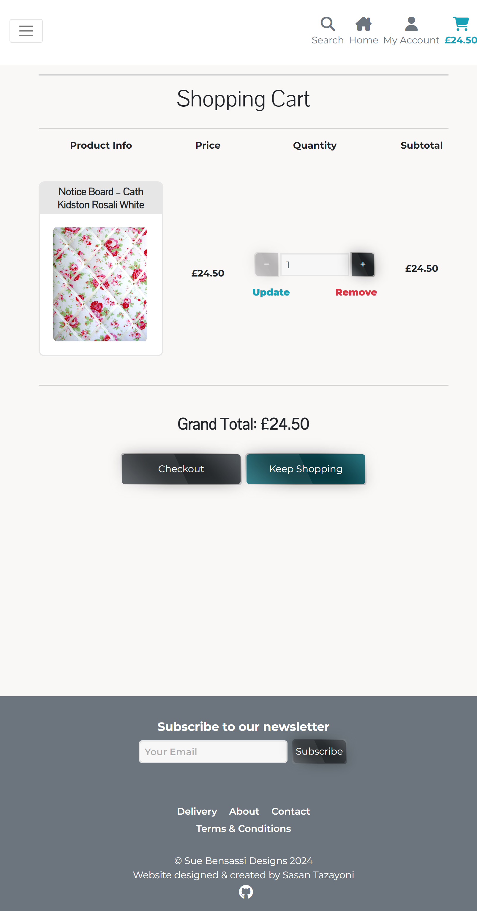

# Testing

> [!NOTE]  
> Return back to the [README.md](README.md) file.

## Code Validation

### HTML

I have used the recommended [HTML W3C Validator](https://validator.w3.org) to validate all of my HTML files.

As my project uses Jinja syntax, such as ``, ``, and `{{ variable|filter }}` it will not validate properly if I copy and paste into the HTML validator straight from my source files. In order to properly validate these types of files, it's recommended to [validate by uri](https://validator.w3.org/#validate_by_uri) from the deployed Heroku pages.

Some of the pages on this site require a user to be logged-in and authenticated and will not work using this method, due to the fact that the HTML Validator (W3C) doesn't have access to login to the pages. In these cases the following steps have to be taken:

* Navigate to the deployed pages which require authentication.
* Right-click on the page and select View Page Source (usually `CTRL+U` or `⌘+U` on Mac).
* This will display the entire "compiled" code, without any Jinja syntax.
* Copy everything, and use the [validate by input](https://validator.w3.org/#validate_by_input) method.
* Repeat this process for every page that requires a user to be logged-in/authenticated.

| Page | W3C URL | Screenshot | Notes |
| --- | --- | --- | --- |
| Cart | [W3C](https://validator.w3.org/nu/?doc=https%3A%2F%2Fsue-bensassi-designs-beea48c7d401.herokuapp.com%2Fcart%2F) |  | Pass: No errors |
| Checkout | [W3C](https://validator.w3.org/nu/?doc=https%3A%2F%2Fsue-bensassi-designs-beea48c7d401.herokuapp.com%2Fcheckout%2F) |  | Pass: No errors |
| Checkout success | n/a |  | Pass: No errors |
| Contact | [W3C](https://validator.w3.org/nu/?doc=https%3A%2F%2Fsue-bensassi-designs-beea48c7d401.herokuapp.com%2Fcontact%2F) |  | Pass: No errors |
| Contact success | [W3C](https://validator.w3.org/nu/?doc=https%3A%2F%2Fsue-bensassi-designs-beea48c7d401.herokuapp.com%2Fcontact%2Fsuccess%2F) |  | Pass: No errors |
| About | [W3C](https://validator.w3.org/nu/?doc=https%3A%2F%2Fsue-bensassi-designs-beea48c7d401.herokuapp.com%2Fabout%2F) |  | Pass: No errors |
| Delivery | [W3C](https://validator.w3.org/nu/?doc=https%3A%2F%2Fsue-bensassi-designs-beea48c7d401.herokuapp.com%2Fdelivery%2F) |  | Pass: No errors |
| Index | [W3C](https://validator.w3.org/nu/?doc=https%3A%2F%2Fsue-bensassi-designs-beea48c7d401.herokuapp.com%2F) |  | Pass: No errors |
| Terms & conditions | [W3C](https://validator.w3.org/nu/?doc=https%3A%2F%2Fsue-bensassi-designs-beea48c7d401.herokuapp.com%2Fterms%2F) |  | Pass: No errors |
| Products | [W3C](https://validator.w3.org/nu/?doc=https%3A%2F%2Fsue-bensassi-designs-beea48c7d401.herokuapp.com%2Fcontact%2Fsuccess%2F) |  | Pass: No errors |
| Product detail | [W3C](https://validator.w3.org/nu/?doc=https%3A%2F%2Fsue-bensassi-designs-beea48c7d401.herokuapp.com%2Fproducts%2F96%2F) |  | Pass: No errors |
| Add product | n/a |  | Pass: No errors |
| Edit product | n/a |  | Pass: No errors |
| Profile | n/a |  | Pass: No errors |
| Sign up | [W3C](https://validator.w3.org/nu/?doc=https%3A%2F%2Fsue-bensassi-designs-beea48c7d401.herokuapp.com%2Faccounts%2Fsignup%2F) |  | Pass: No errors |
| Log in | [W3C](https://validator.w3.org/nu/?doc=https%3A%2F%2Fsue-bensassi-designs-beea48c7d401.herokuapp.com%2Faccounts%2Flogin%2F) |  | Pass: No errors |
| Search | [W3C](https://validator.w3.org/nu/?doc=https%3A%2F%2F8000-sasantazayo-suebensassi-813vyfvgjj0.ws.codeinstitute-ide.net%2Fproducts%2F%3Fq%3Dbook) |  | Pass: No errors |

### CSS

I have used the recommended [CSS Jigsaw Validator](https://jigsaw.w3.org/css-validator) to validate all of my CSS files.

| File | Jigsaw URL | Screenshot | Notes |
| --- | --- | --- | --- |
| styles.css | [Jigsaw](https://jigsaw.w3.org/css-validator/validator?uri=https%3A%2F%2Fsue-bensassi-designs-beea48c7d401.herokuapp.com%2Fstatic%2Fcss%2Fstyles.css&profile=css3svg&usermedium=all&warning=1&vextwarning=&lang=en) |  | Pass: No Errors |

### JavaScript

I have used the recommended [JShint Validator](https://jshint.com) to validate all of my JS files.

| File | Screenshot | Notes |
| --- | --- | --- |
| buttons.js |  | Pass: No Errors |
| disableSubmit.js |  | Pass: No Errors |
| dynamicMargin.js |  | Pass: No Errors |
| logoutModal.js |  | Pass: No Errors |
| navbar.js |  | Pass: No Errors |
| newsletter.js |  | Pass: No Errors |
| quantityInput.js |  | Pass: No Errors |
| scrollToTop.js |  | Pass: No Errors |
| shoppingCartQuantities.js |  | Pass: No Errors |
| stripeElements.js |  | Undefined Stripe variable |
| toasts.js |  | Pass: No Errors |

### Python

I have used the recommended [PEP8 CI Python Linter](https://pep8ci.herokuapp.com) to validate all of my Python files.

| Directory | File | CI URL | Screenshot | Notes |
| --- | --- | --- | --- | --- |
| cart | contexts.py | [PEP8 CI](https://pep8ci.herokuapp.com/https://raw.githubusercontent.com/SasanTazayoni/Sue-bensassi-designs-CI-PP5/main/cart/contexts.py) |  | Pass: No Errors |
| cart | urls.py | [PEP8 CI](https://pep8ci.herokuapp.com/https://raw.githubusercontent.com/SasanTazayoni/Sue-bensassi-designs-CI-PP5/main/cart/urls.py) |  | Pass: No Errors |
| cart | views.py | [PEP8 CI](https://pep8ci.herokuapp.com/https://raw.githubusercontent.com/SasanTazayoni/Sue-bensassi-designs-CI-PP5/main/cart/views.py) |  | Pass: No Errors |
| checkout | admin.py | [PEP8 CI](https://pep8ci.herokuapp.com/https://raw.githubusercontent.com/SasanTazayoni/Sue-bensassi-designs-CI-PP5/main/checkout/admin.py) |  | Pass: No Errors |
| checkout | forms.py | [PEP8 CI](https://pep8ci.herokuapp.com/https://raw.githubusercontent.com/SasanTazayoni/Sue-bensassi-designs-CI-PP5/main/checkout/forms.py) |  | Pass: No Errors |
| checkout | models.py | [PEP8 CI](https://pep8ci.herokuapp.com/https://raw.githubusercontent.com/SasanTazayoni/Sue-bensassi-designs-CI-PP5/main/checkout/models.py) |  | Pass: No Errors |
| checkout | signals.py | [PEP8 CI](https://pep8ci.herokuapp.com/https://raw.githubusercontent.com/SasanTazayoni/Sue-bensassi-designs-CI-PP5/main/checkout/signals.py) |  | Pass: No Errors |
| checkout | urls.py | [PEP8 CI](https://pep8ci.herokuapp.com/https://raw.githubusercontent.com/SasanTazayoni/Sue-bensassi-designs-CI-PP5/main/checkout/urls.py) |  | Pass: No Errors |
| checkout | views.py | [PEP8 CI](https://pep8ci.herokuapp.com/https://raw.githubusercontent.com/SasanTazayoni/Sue-bensassi-designs-CI-PP5/main/checkout/views.py) |  | Pass: No Errors |
| checkout | webhook_handler.py | [PEP8 CI](https://pep8ci.herokuapp.com/https://raw.githubusercontent.com/SasanTazayoni/Sue-bensassi-designs-CI-PP5/main/checkout/webhook_handler.py) |  | Pass: No Errors |
| checkout | webhooks.py | [PEP8 CI](https://pep8ci.herokuapp.com/https://raw.githubusercontent.com/SasanTazayoni/Sue-bensassi-designs-CI-PP5/main/checkout/webhooks.py) |  | Pass: No Errors |
| contact | admin.py | [PEP8 CI](https://pep8ci.herokuapp.com/https://raw.githubusercontent.com/SasanTazayoni/Sue-bensassi-designs-CI-PP5/main/contact/admin.py) |  | Pass: No Errors |
| contact | forms.py | [PEP8 CI](https://pep8ci.herokuapp.com/https://raw.githubusercontent.com/SasanTazayoni/Sue-bensassi-designs-CI-PP5/main/contact/forms.py) |  | Pass: No Errors |
| contact | models.py | [PEP8 CI](https://pep8ci.herokuapp.com/https://raw.githubusercontent.com/SasanTazayoni/Sue-bensassi-designs-CI-PP5/main/contact/models.py) |  | Pass: No Errors |
| contact | urls.py | [PEP8 CI](https://pep8ci.herokuapp.com/https://raw.githubusercontent.com/SasanTazayoni/Sue-bensassi-designs-CI-PP5/main/contact/urls.py) |  | Pass: No Errors |
| contact | views.py | [PEP8 CI](https://pep8ci.herokuapp.com/https://raw.githubusercontent.com/SasanTazayoni/Sue-bensassi-designs-CI-PP5/main/contact/views.py) |  | Pass: No Errors |
| core | urls.py | [PEP8 CI](https://pep8ci.herokuapp.com/https://raw.githubusercontent.com/SasanTazayoni/Sue-bensassi-designs-CI-PP5/main/core/urls.py) |  | Pass: No Errors |
| core | views.py | [PEP8 CI](https://pep8ci.herokuapp.com/https://raw.githubusercontent.com/SasanTazayoni/Sue-bensassi-designs-CI-PP5/main/core/views.py) |  | Pass: No Errors |
| newsletter | admin.py | [PEP8 CI](https://pep8ci.herokuapp.com/https://raw.githubusercontent.com/SasanTazayoni/Sue-bensassi-designs-CI-PP5/main/newsletter/admin.py) |  | Pass: No Errors |
| newsletter | forms.py | [PEP8 CI](https://pep8ci.herokuapp.com/https://raw.githubusercontent.com/SasanTazayoni/Sue-bensassi-designs-CI-PP5/main/newsletter/forms.py) |  | Pass: No Errors |
| newsletter | models.py | [PEP8 CI](https://pep8ci.herokuapp.com/https://raw.githubusercontent.com/SasanTazayoni/Sue-bensassi-designs-CI-PP5/main/newsletter/models.py) |  | Pass: No Errors |
| newsletter | urls.py | [PEP8 CI](https://pep8ci.herokuapp.com/https://raw.githubusercontent.com/SasanTazayoni/Sue-bensassi-designs-CI-PP5/main/newsletter/urls.py) |  | Pass: No Errors |
| newsletter | views.py | [PEP8 CI](https://pep8ci.herokuapp.com/https://raw.githubusercontent.com/SasanTazayoni/Sue-bensassi-designs-CI-PP5/main/newsletter/views.py) |  | Pass: No Errors |
| products | admin.py | [PEP8 CI](https://pep8ci.herokuapp.com/https://raw.githubusercontent.com/SasanTazayoni/Sue-bensassi-designs-CI-PP5/main/products/admin.py) |  | Pass: No Errors |
| products | forms.py | [PEP8 CI](https://pep8ci.herokuapp.com/https://raw.githubusercontent.com/SasanTazayoni/Sue-bensassi-designs-CI-PP5/main/products/forms.py) |  | Pass: No Errors |
| products | models.py | [PEP8 CI](https://pep8ci.herokuapp.com/https://raw.githubusercontent.com/SasanTazayoni/Sue-bensassi-designs-CI-PP5/main/products/models.py) |  | Pass: No Errors |
| products | urls.py | [PEP8 CI](https://pep8ci.herokuapp.com/https://raw.githubusercontent.com/SasanTazayoni/Sue-bensassi-designs-CI-PP5/main/products/urls.py) |  | Pass: No Errors |
| products | views.py | [PEP8 CI](https://pep8ci.herokuapp.com/https://raw.githubusercontent.com/SasanTazayoni/Sue-bensassi-designs-CI-PP5/main/products/views.py) |  | Pass: No Errors |
| products | widgets.py | [PEP8 CI](https://pep8ci.herokuapp.com/https://raw.githubusercontent.com/SasanTazayoni/Sue-bensassi-designs-CI-PP5/main/products/widgets.py) |  | Pass: No Errors |
| profiles | forms.py | [PEP8 CI](https://pep8ci.herokuapp.com/https://raw.githubusercontent.com/SasanTazayoni/Sue-bensassi-designs-CI-PP5/main/profiles/forms.py) |  | Pass: No Errors |
| profiles | models.py | [PEP8 CI](https://pep8ci.herokuapp.com/https://raw.githubusercontent.com/SasanTazayoni/Sue-bensassi-designs-CI-PP5/main/profiles/models.py) |  | Pass: No Errors |
| profiles | urls.py | [PEP8 CI](https://pep8ci.herokuapp.com/https://raw.githubusercontent.com/SasanTazayoni/Sue-bensassi-designs-CI-PP5/main/profiles/urls.py) |  | Pass: No Errors |
| profiles | views.py | [PEP8 CI](https://pep8ci.herokuapp.com/https://raw.githubusercontent.com/SasanTazayoni/Sue-bensassi-designs-CI-PP5/main/profiles/views.py) |  | Pass: No Errors |
| sue_bensassi_designs | settings.py | [PEP8 CI](https://pep8ci.herokuapp.com/https://raw.githubusercontent.com/SasanTazayoni/Sue-bensassi-designs-CI-PP5/main/sue_bensassi_designs/settings.py) |  | Pass: No Errors |
| sue_bensassi_designs | urls.py | [PEP8 CI](https://pep8ci.herokuapp.com/https://raw.githubusercontent.com/SasanTazayoni/Sue-bensassi-designs-CI-PP5/main/sue_bensassi_designs/urls.py) |  | Pass: No Errors |
| sue_bensassi_designs | views.py | [PEP8 CI](https://pep8ci.herokuapp.com/https://raw.githubusercontent.com/SasanTazayoni/Sue-bensassi-designs-CI-PP5/main/sue_bensassi_designs/views.py) |  | Pass: No Errors |

## Browser Compatibility

I've tested my deployed project on multiple browsers to check for compatibility issues.

| Browser | Screenshot | Notes |
| --- | --- | --- |
| Chrome |  | Works as expected |
| Edge |  | Works as expected |
| Firefox |  | Works as expected |

## Responsiveness

I've tested my deployed project on multiple devices to check for responsiveness issues.

| Device | Screenshot | Notes |
| --- | --- | --- |
| desktop |  | Works as expected |
| iPhone-SE |  | Works as expected |
| iPhone-XR |  | Works as expected |
| iPhone-12-Pro |  | Works as expected |
| iPhone-14-Pro-Max |  | Works as expected |
| Pixel-7 |  | Works as expected |
| Samsung-Galaxy-S8+ |  | Works as expected |
| Samsung-Galaxy-S20-Ultra |  | Works as expected |
| iPad-Mini |  | Works as expected |
| iPad-Air |  | Works as expected |
| iPad-Pro |  | Works as expected |
| Surface-Pro-7 |  | Works as expected |
| Surface-Duo |  | Works as expected |
| Galaxy-Z-Fold-5 |  | Works as expected |
| Asus-Zenbook-Fold |  | Works as expected |
| Samsung-Galaxy-A51-71 |  | Works as expected |
| Nest-Hub |  | Works as expected |
| Nest-Hub-Max |  | Works as expected |

## Lighthouse Audit

I've tested my deployed project using the Lighthouse Audit tool to check for any major issues.

| Page | Mobile | Desktop | Notes |
| --- | --- | --- | --- |
| Cart |  |  | Some minor warnings |
| Checkout |  |  | Some minor warnings |
| Checkout success |  |  | Some minor warnings |
| Contact |  |  | Some minor warnings |
| Contact success |  |  | Some minor warnings |
| About |  |  | Some minor warnings |
| Delivery |  |  | Some minor warnings |
| Index |  |  | Some minor warnings |
| Terms & conditions |  |  | Some minor warnings |
| Products |  |  | Some minor warnings |
| Product detail |  |  | Some minor warnings |
| Add product |  |  | Some minor warnings |
| Edit product |  |  | Some minor warnings |
| Profile |  |  | Some minor warnings |
| Sign up |  |  | Some minor warnings |
| Log in |  |  | Some minor warnings |
| Search |  |  | Some minor warnings |

## Defensive Programming

Defensive programming was manually tested with the below user acceptance testing:

| Page | User Action | Expected Result | Pass/Fail | Comments |
| --- | --- | --- | --- | --- |
| All pages | | | | |
| | Click on Logo | Redirection to home page | Pass | |
| | Enter word into search bar that appears in at least one product's name or description and search | Redirection to Products page | Pass | Products filtered to only show products containing search term |
| | Enter word into search bar that doesn't appear in any product's name or description and search | Redirection to Products page | Pass | Products page is empty and shows user that 0 products were returned |
| | Enter nothing into search bar and search | Redirection to Products page | Pass | Error message shows and lets user know they entered nothing into the search bar and all products are displayed |
| | Click off of a toast | Dismisses the toast | Pass | |
| | Click on the home icon | Redirection to Home page | Pass | |
| | Click on the user icon (authenticated user) | Dropdown menu appears | Pass | Dropdown menu has a "Logout" link and a "My profile" link, super users also have the "Add product" link |
| | Click on "Add product" in the user icon dropdown menu as a super user | Redirection to Add product page | Pass | |
| | Click on "My profile" in the user icon the dropdown menu | Redirection to profile page | Pass | |
| | Click on "Logout" in the user icon the dropdown menu | Opens a modal | Pass | The modal is to confirm the log out |
| | Click "Yes" after opening the log out modal (above) | Closes the modal, logs the user out and redirects to the home page | Pass | |
| | Click "No" after opening the log out modal (above) | Dismisses the modal | Pass | |
| | Click on the user icon (non-authenticated user) | Dropdown menu appears | Pass | Dropdown menu has a "Register" link and a "Login" link |
| | Click on "Register" in the user icon the dropdown menu | Redirects to registration page | Pass | |
| | Click on "Login" in the user icon the dropdown menu | Redirects to login page | Pass | |
| | Click on cart icon | Redirects to cart page | Pass | |
| | Click on "All products" link | Dropdown menu appears | Pass | Dropdown menu has the links: "By Price", "By Name", "By Category" and "All products" |

| Contact | | | | |
| | Click on Contact link in navbar | Redirection to Contact page | Pass | |
| | Enter first/last name | Field will accept freeform text | Pass | |
| | Enter valid email address | Field will only accept email address format | Pass | |
| | Enter message in textarea | Field will accept freeform text | Pass | |
| | Click the Submit button | Redirects user to form-dump | Pass | User must click 'Back' button to return |
| Sign Up | | | | |
| | Click on Sign Up button | Redirection to Sign Up page | Pass | |
| | Enter valid email address | Field will only accept email address format | Pass | |
| | Enter valid password (twice) | Field will only accept password format | Pass | |
| | Click on Sign Up button | Asks user to confirm email page | Pass | Email sent to user |
| | Confirm email | Redirects user to blank Sign In page | Pass | |
| Log In | | | | |
| | Click on the Login link | Redirection to Login page | Pass | |
| | Enter valid email address | Field will only accept email address format | Pass | |
| | Enter valid password | Field will only accept password format | Pass | |
| | Click Login button | Redirects user to home page | Pass | |
| Log Out | | | | |
| | Click Logout button | Redirects user to logout page | Pass | Confirms logout first |
| | Click Confirm Logout button | Redirects user to home page | Pass | |
| Profile | | | | |
| | Click on Profile button | User will be redirected to the Profile page | Pass | |
| | Click on the Edit button | User will be redirected to the edit profile page | Pass | |
| | Click on the My Orders link | User will be redirected to the My Orders page | Pass | |
| | Brute forcing the URL to get to another user's profile | User should be given an error | Pass | Redirects user back to own profile |
| repeat for all remaining pages | x | x | x | x |

## User Story Testing

| Epic | User Story | Screenshot |
| --- | --- | --- |
| EPIC 1: User Account Management | | |
| | As a new site user I can register and establish a personal account on the site so that I can make purchases using my own credentials. |  |
| | As a registered user I can log in to my account so that I can review products that I have purchased, view my order history and order products using my credentials. |  |
| | As a registered user I can log out of my account so that I can securely end my session and protect my personal information. |  |
| | As a registered user/site admin I can reset my password so that I can regain access to my account in case I forget my password. |  |
| | As a registered user I can edit my account information so that I can ensure that my profile remains up to date and accurate. |  |
| EPIC 2: Product Exploration | | |
| | As a site user I can see a list of all products so that I can easily browse and explore the full range of available items. |  |
| | As a site user I can see the price of a product clearly so that I can make a decision whether to purchase the item or not. |  |
| | As a site user I can view a product on its own individual page so that see more details about the product. |  |
| | As a site user I can sort products by category so that I can find specific products based on the category I select. |  |
| | As a site user I can view a list of best-selling items so that I can easily discover popular products that are favoured by other customers, helping me make informed purchasing decisions. |  |
| | As a site user I can view the stock count of products so that I can make informed purchasing decisions based on the availability of items. |  |
| EPIC 3: Shopping Experience | | |
| | As a site user I can add items to my cart so that I can conveniently gather desired products in one place while browsing in order to purchase. |  |
| | As a site user I can adjust the quantity of items in my cart so that I can easily increase or decrease the number of items I wish to purchase. |  |
| | As a site user I can remove items from my cart so that I can refine my choices and ensure that my final purchase consists only of the items I truly intend to buy. |  |
| | As a site user I can view the items in my cart so that I can review my selected products, check quantities and verify prices before proceeding to checkout. |  |
| | As a site user I can checkout with a card payment so that I can complete my purchase transaction securely and efficiently, providing my payment and shipping information to finalise the order and receive the products I have selected. |  |
| | As a site user I can receive an email which confirms my order after purchasing from the store so that I can review the details of my purchase and be reassured that my order was successfully processed. |  |
| | As a registered user I can access my order history so that I can review past purchases, track the status of my orders and keep a record of my transactions. |  |
| | As a site user I can use a search bar to search the website so that I can find a specific product. |  |
| EPIC 4: Product Management (Admin) | | |
| | As a site admin I can set the stock count for each product so that I can accurately manage inventory levels, prevent overselling or stockouts and ensure that site users have access to up-to-date information on product availability. |  |
| | As a site admin I can add products to the store so that I can expand the range of available items and keep the product catalogue updated. |  |
| | As a site admin I can edit the details of a specific product so that I can keep product information accurate and up to date. |  |
| | As a site admin I can remove products from the store so that I can manage inventory effectively, removing discontinued or outdated items. |  |
| EPIC 5: Site Information | | |
| | As a new site user I can learn about the background of the merchant so that I can gain insight into the company's values and expertise, fostering trust and confidence in their products or services. |  |
| | As a site user I can access delivery information so that I can understand the shipping options, delivery times and any associated costs, enabling me to plan my purchases accordingly and ensure a smooth and timely delivery of my orders. |  |
| | As a site user I can view the terms and conditions so that I can understand the rules, regulations, and agreements governing the use of the platform, ensuring transparency and clarity in my interactions with the website. |  |
| | As a site user I can easily find and access the store owner's contact information so that I can get in touch for inquiries or assistance. |  |
| EPIC 6: Marketing and Engagement | | |
| | As a site user I can sign up for the site's mailing list so that I can receive special offers and updates in my inbox. |  |
| | As a site admin I can view my mailing list so that I can send special offers or news updates about my products to my subscribers. |  |
| | As a site admin I can a comprehensive list of customer enquiries so that efficiently address each one and manage my responses accordingly. |  |
| | As a site admin I can share the business on Facebook so that I can increase visibility and reach for the platform, attract new users and engage with existing ones on a popular social media platform, ultimately driving traffic to the site and potentially boosting sales and brand recognition. |  |
| | As a site admin I can use specific keywords on site pages so that I maximise the probability of new customers locating the store on a Google search. |  |
| EPIC 7: Additional Features | | |
| | As a site user I can see humorous fake items on the 404 error page so that I can enjoy a playful experience when encountering page errors. |  |
| EPIC 8: User Experience and Interface | | |
| | As a new site user I can comprehend the website's purpose at a glance so that I can determine if the platform aligns with my needs and interests. |  |
| | As a site user I can navigate through the interface effortlessly so that I can quickly and easily find the information I need. |  |

The following are user stories I wasn't able to implement and have labeled as Wont Have in my MoSCoW prioritisation:

| User Story | Screenshot |
| As a site user I can filter products by price so that I can easily find items that fit within my budget. | n/a |
| As a site user I can receive notifications so that I am promptly informed about any special offers or discounts available on the website. | n/a |
| As a site user I can view product reviews so that I can make informed purchasing decisions by considering the experiences and opinions of other customers. | n/a |
| As a registered user I can submit a review for a product that I have previously bought so that I can share my experiences and opinions with other users. | n/a |
| As a registered user I can edit my review on a product so that I can update or improve the information I provided based on further experiences with the product. | n/a |
| As a registered user I can delete my review on a product so that I can remove outdated or inaccurate feedback. | n/a |

## Automated Testing

I have conducted a series of automated tests on my application.

I fully acknowledge and understand that, in a real-world scenario, an extensive set of additional tests would be more comprehensive.

### Python (Unit Testing)

🛑🛑🛑🛑🛑🛑🛑🛑🛑🛑-START OF NOTES (to be deleted)

Adjust the code below (file names, etc.) to match your own project files/folders.

🛑🛑🛑🛑🛑🛑🛑🛑🛑🛑-END OF NOTES (to be deleted)

I have used Django's built-in unit testing framework to test the application functionality.

In order to run the tests, I ran the following command in the terminal each time:

`python3 manage.py test name-of-app `

To create the coverage report, I would then run the following commands:

`coverage run --source=name-of-app manage.py test`

`coverage report`

To see the HTML version of the reports, and find out whether some pieces of code were missing, I ran the following commands:

`coverage html`

`python3 -m http.server`

Below are the results from the various apps on my application that I've tested:

| App | File | Coverage | Screenshot |
| --- | --- | --- | --- |
| Bag | test_forms.py | 99% |  |
| Bag | test_models.py | 89% |  |
| Bag | test_urls.py | 100% |  |
| Bag | test_views.py | 71% |  |
| Checkout | test_forms.py | 99% |  |
| Checkout | test_models.py | 89% |  |
| Checkout | test_urls.py | 100% |  |
| Checkout | test_views.py | 71% |  |
| Home | test_forms.py | 99% |  |
| Home | test_models.py | 89% |  |
| Home | test_urls.py | 100% |  |
| Home | test_views.py | 71% |  |
| Products | test_forms.py | 99% |  |
| Products | test_models.py | 89% |  |
| Products | test_urls.py | 100% |  |
| Products | test_views.py | 71% |  |
| Profiles | test_forms.py | 99% |  |
| Profiles | test_models.py | 89% |  |
| Profiles | test_urls.py | 100% |  |
| Profiles | test_views.py | 71% |  |
| x | x | x | repeat for all remaining tested apps/files |

#### Unit Test Issues

🛑🛑🛑🛑🛑🛑🛑🛑🛑🛑-START OF NOTES (to be deleted)

Use this section to list any known issues you ran into while writing your unit tests.
Remember to include screenshots (where possible), and a solution to the issue (if known).

This can be used for both "fixed" and "unresolved" issues.

🛑🛑🛑🛑🛑🛑🛑🛑🛑🛑-END OF NOTES (to be deleted)

## Bugs

🛑🛑🛑🛑🛑🛑🛑🛑🛑🛑-START OF NOTES (to be deleted)

This section is primarily used for JavaScript and Python applications,
but feel free to use this section to document any HTML/CSS bugs you might run into.

It's very important to document any bugs you've discovered while developing the project.
Make sure to include any necessary steps you've implemented to fix the bug(s) as well.

**PRO TIP**: screenshots of bugs are extremely helpful, and go a long way!

🛑🛑🛑🛑🛑🛑🛑🛑🛑🛑-END OF NOTES (to be deleted)

- JS Uncaught ReferenceError: `foobar` is undefined/not defined

    

    - To fix this, I _____________________.

- JS `'let'` or `'const'` or `'template literal syntax'` or `'arrow function syntax (=>)'` is available in ES6 (use `'esversion: 11'`) or Mozilla JS extensions (use moz).

    

    - To fix this, I _____________________.

- Python `'ModuleNotFoundError'` when trying to import module from imported package

    

    - To fix this, I _____________________.

- Django `TemplateDoesNotExist` at /appname/path appname/template_name.html

    

    - To fix this, I _____________________.

- Python `E501 line too long` (93 > 79 characters)

    

    - To fix this, I _____________________.

### GitHub **Issues**

🛑🛑🛑🛑🛑🛑🛑🛑🛑🛑-START OF NOTES (to be deleted)

An improved way to manage bugs is to use the built-in **Issues** tracker on your GitHub repository.
To access your Issues, click on the "Issues" tab at the top of your repository.
Alternatively, use this link: https://github.com/SasanTazayoni/Sue-bensassi-designs-CI-PP5/issues

If using the Issues tracker for your bug management, you can simplify the documentation process.
Issues allow you to directly paste screenshots into the issue without having to first save the screenshot locally,
then uploading into your project.

You can add labels to your issues (`bug`), assign yourself as the owner, and add comments/updates as you progress with fixing the issue(s).

Once you've sorted the issue, you should then "Close" it.

When showcasing your bug tracking for assessment, you can use the following format:

🛑🛑🛑🛑🛑🛑🛑🛑🛑🛑-END OF NOTES (to be deleted)

**Fixed Bugs**

All previously closed/fixed bugs can be tracked [here](https://github.com/SasanTazayoni/Sue-bensassi-designs-CI-PP5/issues?q=is%3Aissue+is%3Aclosed).

| Bug | Status |
| --- | --- |
| [JS Uncaught ReferenceError: `foobar` is undefined/not defined](https://github.com/SasanTazayoni/Sue-bensassi-designs-CI-PP5/issues/1) | Closed |
| [Python `'ModuleNotFoundError'` when trying to import module from imported package](https://github.com/SasanTazayoni/Sue-bensassi-designs-CI-PP5/issues/2) | Closed |
| [Django `TemplateDoesNotExist` at /appname/path appname/template_name.html](https://github.com/SasanTazayoni/Sue-bensassi-designs-CI-PP5/issues/3) | Closed |

**Open Issues**

Any remaining open issues can be tracked [here](https://github.com/SasanTazayoni/Sue-bensassi-designs-CI-PP5/issues).

| Bug | Status |
| --- | --- |
| [JS `'let'` or `'const'` or `'template literal syntax'` or `'arrow function syntax (=>)'` is available in ES6 (use `'esversion: 11'`) or Mozilla JS extensions (use moz).](https://github.com/SasanTazayoni/Sue-bensassi-designs-CI-PP5/issues/4) | Open |
| [Python `E501 line too long` (93 > 79 characters)](https://github.com/SasanTazayoni/Sue-bensassi-designs-CI-PP5/issues/5) | Open |

## Unfixed Bugs

🛑🛑🛑🛑🛑🛑🛑🛑🛑🛑-START OF NOTES (to be deleted)

You will need to mention unfixed bugs and why they were not fixed.
This section should include shortcomings of the frameworks or technologies used.
Although time can be a big variable to consider, paucity of time and difficulty understanding
implementation is not a valid reason to leave bugs unfixed.

If you've identified any unfixed bugs, no matter how small, be sure to list them here.
It's better to be honest and list them, because if it's not documented and an assessor finds the issue,
they need to know whether or not you're aware of them as well, and why you've not corrected/fixed them.

Some examples:

🛑🛑🛑🛑🛑🛑🛑🛑🛑🛑-END OF NOTES (to be deleted)

- On devices smaller than 375px, the page starts to have `overflow-x` scrolling.

    

    - Attempted fix: I tried to add additional media queries to handle this, but things started becoming too small to read.

- For PP3, when using a helper `clear()` function, any text above the height of the terminal does not clear, and remains when you scroll up.

    

    - Attempted fix: I tried to adjust the terminal size, but it only resizes the actual terminal, not the allowable area for text.

- When validating HTML with a semantic `section` element, the validator warns about lacking a header `h2-h6`. This is acceptable.

    

    - Attempted fix: this is a known warning and acceptable, and my section doesn't require a header since it's dynamically added via JS.

🛑🛑🛑🛑🛑🛑🛑🛑🛑🛑-START OF NOTES (to be deleted)

If you legitimately cannot find any unfixed bugs or warnings, then use the following sentence:

🛑🛑🛑🛑🛑🛑🛑🛑🛑🛑-END OF NOTES (to be deleted)

> [!NOTE]  
> There are no remaining bugs that I am aware of.
